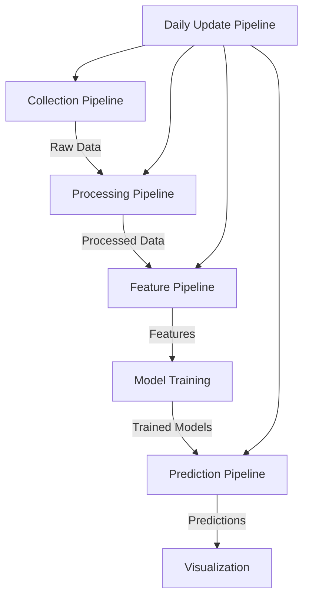

# NCAA Basketball Prediction Model

📚 **[View Full Documentation](https://tim-mcdonnell.github.io/ncaa-prediction-model/)**

## Overview
This project develops a machine learning model to predict NCAA men's basketball game outcomes using 22 years of historical data. By analyzing team statistics, tournament performance, and other relevant factors, we create a data-driven approach to:

- Generate team rating metrics
- Calculate predicted point spreads (similar to Vegas lines)
- Predict total points (over/under)
- Determine win probability for each matchup

## Features
- **Data Collection**: Automated retrieval of historical data from ESPN API endpoints
- **Data Processing**: Cleaning, transformation, and feature engineering pipeline
- **Feature Engineering**: Calculation of 60+ basketball metrics of varying complexity
- **Machine Learning**: Predictive modeling using team performance metrics
- **Pipeline Architecture**: End-to-end orchestration for incremental and full processing
- **Visualization**: Interactive dashboard to explore underlying data, features, and model performance

## Tech Stack
- Python 3.11
- [uv](https://github.com/astral-sh/uv) for package management
- [ruff](https://github.com/astral-sh/ruff) for linting
- Data Processing: Polars, Parquet
- Machine Learning: Scikit-learn, TensorFlow/PyTorch
- Visualization: Plotly, Dash
- Testing: pytest with TDD approach

## Pipeline Architecture

The project implements a modular pipeline architecture that orchestrates the flow from data collection to prediction:



Key benefits of this architecture:
- **Incremental Processing**: Efficiently update only what has changed
- **Dependency Management**: Features are calculated in the correct order
- **Simple CLI**: Command-line interface for running pipelines

## Quick Start

### Setup
```bash
# Clone the repository
git clone https://github.com/tim-mcdonnell/ncaa-prediction-model.git
cd ncaa-prediction-model

# Install uv
curl -LsSf https://astral.sh/uv/install.sh | sh

# Create and activate virtual environment
uv venv
source .venv/bin/activate  # On Windows: .venv\Scripts\activate

# Install dependencies
uv pip install -e .
```

### Basic Usage
```bash
# Run the complete end-to-end pipeline
python -m src.run all

# Run data collection for the current season
python -m src.run collect

# Run daily update (during basketball season)
python -m src.run daily
```

For more detailed information, see the [full documentation](https://tim-mcdonnell.github.io/ncaa-prediction-model/).

## Project Structure
The project follows a modular structure with clear separation of concerns:

```
ncaa-prediction-model/
├── data/                  # Data organized by processing stage
├── src/                   # Source code
│   ├── data/              # Data collection and processing
│   │   ├── collect_ncaa_data.py  # Data collection script
│   │   └── validate_ncaa_data.py # Data validation script
│   ├── features/          # Feature engineering
│   ├── models/            # ML models
│   ├── pipelines/         # Pipeline orchestration
│   └── visualization/     # Dashboard and visualization code
├── tests/                 # Unit and integration tests
├── docs/                  # Documentation
└── configs/               # Configuration files
```

## Project Milestones
The project is organized into 7 key milestones:

1. **Data Collection and Storage** - 🔄 In Progress
2. **Data Validation and Quality Control** - ⏱️ Not Started
3. **Feature Engineering** - ⏱️ Not Started
4. **Model Development** - ⏱️ Not Started
5. **Backtesting Framework** - ⏱️ Not Started
6. **Visualization and Dashboard** - ⏱️ Not Started
7. **Deployment and Monitoring** - ⏱️ Not Started

For detailed information on each milestone, see the [GitHub milestones page](https://github.com/tim-mcdonnell/ncaa-prediction-model/milestones).

## Development Approach

This project follows a Test-Driven Development (TDD) approach:
1. Write tests that define expected behavior before implementation
2. Implement the minimal code needed to pass tests
3. Refactor for clarity and efficiency while maintaining test coverage

## License
[MIT License](LICENSE)

## Data Collection

The data collection process fetches NCAA basketball game data from the ESPN API. The process includes:

1. Collecting raw game data for specified seasons
2. Processing and cleaning the data
3. Validating the data quality
4. Storing the data in a structured format for analysis

### Running the Data Collection Pipeline

To run the full data collection pipeline:

```bash
./run_data_collection.py --start-year 2023 --end-year 2023
```

This will:
- Collect game data for the specified seasons
- Validate the collected data
- Generate quality reports

#### Command Line Options

- `--start-year`: First season to collect (default: 2023)
- `--end-year`: Last season to collect (default: 2023)
- `--skip-collection`: Skip the data collection step and only run validation
- `--skip-validation`: Skip the validation step and only run collection

### Data Structure

The collected data is stored in the following structure:

```
data/
├── raw/                      # Raw data from the API
├── targeted_collection/      # Processed data
│   ├── all_games.parquet     # All games in a single file
│   └── validated/            # Validated and cleaned data
│       ├── cleaned_games.parquet     # Cleaned data
│       ├── validation_report.json    # Data validation report
│       └── quality_report.json       # Data quality metrics
```

### Data Fields

The collected game data includes the following fields:

- `id`: Unique game identifier
- `date`: Game date (YYYYMMDD format)
- `name`: Game name/description
- `home_team_id`: Home team identifier
- `home_team_name`: Home team name
- `away_team_id`: Away team identifier
- `away_team_name`: Away team name
- `home_score`: Home team score
- `away_score`: Away team score
- `status`: Game status (e.g., "STATUS_FINAL")
- `collection_timestamp`: Timestamp when the data was collected

## Development

### Prerequisites

- Python 3.9+
- Required packages listed in `requirements.txt`

### Installation

1. Clone the repository
2. Install dependencies:
   ```bash
   pip install -r requirements.txt
   ```

### Project Structure

```
ncaa-prediction-model/
├── data/                     # Data directory
├── logs/                     # Log files
├── src/                      # Source code
│   ├── data/                 # Data collection and processing
│   │   ├── collect_ncaa_data.py  # Data collection script
│   │   └── validate_ncaa_data.py # Data validation script
│   └── models/               # Prediction models
├── run_data_collection.py    # Main pipeline script
└── README.md                 # This file
```

## License

[MIT License](LICENSE)