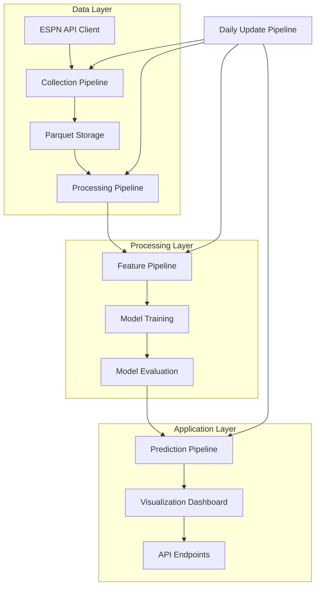

# System Architecture

## High-Level Architecture

The NCAA Basketball Prediction Model is built with a modular pipeline architecture that separates concerns and allows for independent development and testing of components.



## Component Breakdown

### Data Layer

- **ESPN API Client**: Handles communication with the ESPN API, including rate limiting and error handling.
- **Collection Pipeline**: Orchestrates data retrieval and synchronization, with support for incremental updates.
- **Parquet Storage**: Stores data in columnar Parquet files organized by processing stage.
- **Processing Pipeline**: Cleans and transforms raw data into standardized formats.

### Processing Layer

- **Feature Pipeline**: Calculates 60+ basketball metrics with automatic dependency resolution.
- **Model Training**: Builds and optimizes prediction models.
- **Model Evaluation**: Assesses model performance with appropriate metrics.

### Application Layer

- **Prediction Pipeline**: Generates predictions for upcoming games.
- **Visualization Dashboard**: Provides interactive visualizations of data and predictions.
- **API Endpoints**: Offers programmatic access to predictions and data.

### Cross-Cutting Concerns

- **Daily Update Pipeline**: Combines all pipelines for efficient daily updates during basketball season.
- **Configuration Management**: Provides centralized configuration for all components.
- **Logging and Monitoring**: Tracks pipeline execution and performance.

## Technical Decisions

### Storage Strategy

We use a Parquet-first approach for data storage, which provides:

- **Columnar Format**: Optimized for analytical queries and feature calculation
- **Efficient Compression**: Reduced storage requirements
- **Schema Evolution**: Flexibility as data formats evolve
- **Partitioning**: Organization by season, team, or other dimensions
- **Direct Integration**: Seamless use with Polars for data processing

### Pipeline Architecture

Our pipeline architecture is designed for:

- **Incremental Processing**: Only update what has changed
- **Dependency Management**: Calculate features in the correct order
- **Configuration Management**: Flexible control of pipeline behavior
- **Error Handling**: Robust recovery from failures
- **Progress Tracking**: Visibility into long-running processes
- **Simple CLI**: Easy execution of pipeline components

### Data Processing

We use Polars for all data processing, which provides:

- **Performance**: 10-100x faster than traditional pandas for our workloads
- **Memory Efficiency**: Better handling of large datasets
- **Expressive API**: Clean, functional data transformation
- **Lazy Evaluation**: Optimized execution plans
- **Parallelism**: Automatic use of multiple cores

## Pipeline Architecture

Our pipeline architecture is designed for:

- **Incremental Processing**: Only update what has changed
- **Dependency Management**: Calculate features in the correct order
- **Configuration Management**: Flexible control of pipeline behavior
- **Error Handling**: Robust recovery from failures
- **Progress Tracking**: Visibility into long-running processes
- **Simple CLI**: Easy execution of pipeline components

### Base Pipeline Framework

The pipeline framework provides a standardized approach to data processing tasks with consistent patterns for lifecycle management, state tracking, error handling, and more. It consists of four core components:

```
┌─────────────────────────────────────────────────────────────────────┐
│                                                                     │
│                       Pipeline Framework                            │
│                                                                     │
│   ┌───────────┐  ┌────────────┐  ┌────────────┐  ┌────────────┐    │
│   │           │  │            │  │            │  │            │    │
│   │ Base      │  │ Pipeline   │  │ Monitoring │  │ Dependency │    │
│   │ Pipeline  │  │ Composition│  │ Hooks      │  │ Injection  │    │
│   │           │  │            │  │            │  │            │    │
│   └───────────┘  └────────────┘  └────────────┘  └────────────┘    │
│                                                                     │
└─────────────────────────────────────────────────────────────────────┘
```

#### Pipeline Lifecycle

Each pipeline follows a defined lifecycle:

```
┌─────────┐      ┌───────────┐     ┌────────────┐     ┌─────────┐     ┌─────────┐
│         │      │           │     │            │     │         │     │         │
│  Init   │─────▶│  Validate │────▶│  Execute   │────▶│ Results │────▶│ Cleanup │
│         │      │           │     │            │     │         │     │         │
└─────────┘      └───────────┘     └────────────┘     └─────────┘     └─────────┘
                       │                  │
                       │                  │
                       ▼                  ▼
                  ┌────────┐         ┌────────┐
                  │        │         │        │
                  │ Fail   │         │ Error  │
                  │        │         │        │
                  └────────┘         └────────┘
```

1. **Initialization**: Pipeline is constructed with configuration and dependencies
2. **Validation**: Input data and parameters are validated
3. **Execution**: Core pipeline logic processes the inputs
4. **Results**: Standardized result structure is returned
5. **Cleanup**: Resources are properly released

#### Pipeline Composition

Pipeline composition allows for creating complex data flows by chaining multiple pipelines together sequentially. Each pipeline in the chain receives the output of the previous pipeline as its input:

```
┌─────────────────────────────────────────────────────────────┐
│                                                             │
│                    ComposedPipeline                         │
│                                                             │
│   ┌─────────────┐    ┌─────────────┐    ┌─────────────┐    │
│   │             │    │             │    │             │    │
│   │  Pipeline A │───▶│  Pipeline B │───▶│  Pipeline C │    │
│   │             │    │             │    │             │    │
│   └─────────────┘    └─────────────┘    └─────────────┘    │
│                                                             │
└─────────────────────────────────────────────────────────────┘
```

This approach offers:
- Simple building blocks that are easy to test
- Reusable pipeline components
- Flexible composition for different workflow requirements
- Standardized data flow between components

#### Dependency Injection

Dependency injection provides flexible configuration and easier testing by allowing dependencies to be swapped or mocked:

```
┌────────────────────────────────────────────────────┐
│                                                    │
│                Dependency Registry                 │
│                                                    │
│  ┌───────────────────┐    ┌───────────────────┐   │
│  │                   │    │                   │   │
│  │   Interface A     │───▶│  Implementation X │   │
│  │                   │    │                   │   │
│  └───────────────────┘    └───────────────────┘   │
│                                                    │
├────────────────────────────────────────────────────┤
│                                                    │
│                     Pipeline                       │
│                                                    │
└────────────────────────────────────────────────────┘
```

Key benefits include:
- Easier unit testing with mock implementations
- Flexible runtime configuration
- Cleaner separation of concerns
- Simplified pipeline construction

#### Monitoring and Telemetry

The monitoring subsystem captures events from pipelines to enable telemetry, metrics collection, and troubleshooting:

```
┌───────────────────────────┐
│                           │
│      Pipeline Execution   │
│                           │
└───────────┬───────────────┘
            │
            │ generates
            │ events
            ▼
┌───────────────────────────┐          ┌───────────────────┐
│                           │          │                   │
│     Monitoring Events     │─────────▶│  Console Monitor  │
│                           │          │                   │
└───────────┬───────────────┘          └───────────────────┘
            │
            │                          ┌───────────────────┐
            │                          │                   │
            └─────────────────────────▶│  Stats Monitor    │
                                       │                   │
                                       └───────────────────┘
```

Multiple monitors can be registered to handle events including:
- Pipeline start/end
- Success/failure events
- Timing information
- Error details
- Resource utilization

#### Usage Examples

The Base Pipeline Framework can be used in various ways to build data processing components. Here are examples demonstrating key features:

**Creating a Custom Pipeline**

```python
from src.pipelines.base_pipeline import BasePipeline, PipelineContext, PipelineResult, PipelineStatus
import polars as pl

class TeamStatsCalculator(BasePipeline):
    """A pipeline that calculates team statistics."""
    
    def __init__(self, metric_type: str = "scoring"):
        super().__init__()
        self.metric_type = metric_type
    
    async def _validate(self, context: PipelineContext) -> bool:
        """Validate that input data contains required columns."""
        if "game_data" not in context.input_data:
            return False
            
        df = context.input_data["game_data"]
        required_cols = ["team_id", "points"]
        
        if self.metric_type == "efficiency":
            # Also require possessions data
            required_cols.append("possessions")
            
        return all(col in df.columns for col in required_cols)
    
    async def _execute(self, context: PipelineContext) -> PipelineResult:
        """Calculate team statistics from game data."""
        df = context.input_data["game_data"]
        
        # Group by team and calculate stats
        if self.metric_type == "scoring":
            result_df = df.group_by("team_id").agg(
                pl.mean("points").alias("ppg")
            )
        elif self.metric_type == "efficiency":
            result_df = df.group_by("team_id").agg(
                pl.sum("points"),
                pl.sum("possessions")
            ).with_columns(
                (pl.col("points") / pl.col("possessions") * 100).alias("off_efficiency")
            )
        
        return PipelineResult(
            status=PipelineStatus.SUCCESS,
            output_data={"stats": result_df},
            metadata={"metric_type": self.metric_type}
        )
    
    async def _cleanup(self) -> None:
        """No resources to clean up for this pipeline."""
        pass
```

**Composing Multiple Pipelines**

```python
from src.pipelines.pipeline_composition import ComposedPipeline
from src.pipelines.base_pipeline import PipelineContext

# Create individual pipelines
data_loader = DataLoaderPipeline(source="parquet")
data_filter = DataFilterPipeline(min_games=20)
stats_calculator = TeamStatsCalculator(metric_type="efficiency")

# Compose them into a single pipeline
analysis_pipeline = ComposedPipeline(
    name="team_analysis",
    pipelines=[data_loader, data_filter, stats_calculator]
)

# Execute the composed pipeline
context = PipelineContext(params={"season": 2023})
result = await analysis_pipeline.execute(context)

# Get the output from the final stage
team_stats = result.output_data["stats"]
```

**Using Dependency Injection**

```python
from src.pipelines.dependency_injection import injectable, Dependency
from typing import Protocol

# Define protocol for a dependency
class DataStorage(Protocol):
    async def save_data(self, df: pl.DataFrame, path: str) -> bool: ...

# Create a pipeline with injectable dependencies
class DataExportPipeline(BasePipeline):
    @injectable
    def __init__(self, storage: DataStorage):
        super().__init__()
        self.storage = storage
    
    async def _execute(self, context: PipelineContext) -> PipelineResult:
        # Use the injected storage implementation
        success = await self.storage.save_data(
            context.input_data["data"],
            context.params.get("output_path", "data/default.parquet")
        )
        return PipelineResult(
            status=PipelineStatus.SUCCESS if success else PipelineStatus.FAILURE
        )

# Register implementations with the dependency registry
Dependency.register(DataStorage, ParquetStorage())

# Create pipeline without explicitly providing dependencies
export_pipeline = DataExportPipeline()  # Storage will be injected automatically
```

**Adding Custom Monitoring**

```python
from src.pipelines.monitoring import PipelineMonitor, MonitoringEvent, register_monitor

# Create a custom monitor 
class PerformanceMonitor(PipelineMonitor):
    async def record_event(self, event: MonitoringEvent) -> None:
        if event.event_type == "pipeline_end":
            execution_time = event.data.get("execution_time_ms", 0)
            print(f"Pipeline {event.pipeline_name} took {execution_time}ms to execute")

# Register the monitor
register_monitor(PerformanceMonitor())

# Now all pipeline executions will be monitored automatically
```

For complete working examples, see:
- `examples/pipelines/simple_pipeline_example.py` - Basic pipeline implementation
- `examples/pipelines/pipeline_composition_example.py` - Pipeline composition
- `examples/pipelines/dependency_injection_example.py` - Dependency injection
- `examples/pipelines/monitoring_example.py` - Monitoring and telemetry

For configuration options and environment variables, see:
- [Pipeline Framework](components/pipeline_framework.md) - Detailed configuration options

### Pipeline Components

All pipelines inherit from a common `BasePipeline` class that provides:

- Configuration management
- Logging setup
- Progress tracking for long-running operations
- Error handling

### Collection Pipeline

The Collection Pipeline fetches data from external sources (primarily ESPN APIs) and stores it as raw Parquet files.

**Key capabilities:**
- Fetching complete seasons of NCAA basketball data
- Incremental updates during the season (only fetching new/changed games)
- Resilient error handling for network requests
- Rate limiting to respect API constraints

**Example usage:**
```python
from pipelines.collection_pipeline import CollectionPipeline

# Initialize pipeline
pipeline = CollectionPipeline()

# Collect a specific season
await pipeline.collect_season_games(season=2023)

# Collect all seasons
await pipeline.collect_all_seasons(start_year=2002)

# Incremental update of current season
await pipeline.collect_season_games(
    season=2024, 
    mode="incremental"
)
```

### Processing Pipeline

The Processing Pipeline transforms raw data into standardized formats suitable for feature engineering.

**Key capabilities:**
- Cleaning and standardizing data formats
- Merging related datasets
- Validating data consistency
- Handling incremental updates

**Example usage:**
```python
from pipelines.processing_pipeline import ProcessingPipeline

# Initialize pipeline
pipeline = ProcessingPipeline()

# Process a single season
pipeline.process_raw_games(season=2023)

# Process all seasons
pipeline.process_all_seasons()

# Incremental processing
pipeline.process_raw_games(
    season=2024,
    incremental=True
)
```

### Feature Pipeline

The Feature Pipeline calculates basketball metrics from processed data. It handles feature dependencies and ensures features are calculated in the correct order.

**Key capabilities:**
- Automatic dependency resolution
- Selective feature calculation
- Season filtering
- Progress tracking for long calculations

**Example usage:**
```python
from pipelines.feature_pipeline import FeaturePipeline

# Initialize pipeline
pipeline = FeaturePipeline()

# Calculate all features
pipeline.calculate_features()

# Calculate specific features
pipeline.calculate_features(
    feature_ids=["team_offensive_efficiency", "team_defensive_efficiency"]
)

# Calculate features for specific seasons
pipeline.calculate_features(
    seasons=[2023, 2024]
)

# Force recalculation of features
pipeline.calculate_features(
    force_recalculate=True
)
```

### Prediction Pipeline

The Prediction Pipeline generates game predictions based on calculated features.

**Key capabilities:**
- Loading and applying trained models
- Generating predictions for upcoming games
- Exporting prediction results
- Calculating prediction accuracy for past games

**Example usage:**
```python
from pipelines.prediction_pipeline import PredictionPipeline

# Initialize pipeline
pipeline = PredictionPipeline()

# Generate predictions for today's games
pipeline.generate_predictions()

# Generate predictions for a specific date
import datetime
pipeline.generate_predictions(
    target_date=datetime.date(2024, 3, 15)
)
```

### Daily Update Pipeline

The Daily Update Pipeline combines the other pipelines to provide a simple interface for running daily updates during the basketball season.

**Key capabilities:**
- End-to-end orchestration
- Determining the current basketball season
- Skipping unnecessary work when no new data is available
- Comprehensive logging

**Example usage:**
```python
from pipelines.daily_update import DailyUpdatePipeline

# Initialize pipeline
pipeline = DailyUpdatePipeline()

# Run daily update
await pipeline.run_daily_update()

# Run update for a specific date
import datetime
await pipeline.run_daily_update(
    target_date=datetime.date(2024, 3, 15)
)

# Update specific features
await pipeline.run_daily_update(
    feature_ids=["team_offensive_efficiency"]
)
```

## Command-Line Interface

The pipeline architecture includes a command-line interface for running pipelines without writing Python code.

```bash
# Run the complete pipeline
python -m src.run all

# Collect data for the current season
python -m src.run collect

# Collect all historical seasons
python -m src.run collect --full

# Process raw data
python -m src.run process

# Calculate features
python -m src.run features

# Calculate specific features
python -m src.run features --ids="team_offensive_efficiency,team_defensive_efficiency"

# Generate predictions
python -m src.run predict

# Run daily update
python -m src.run daily
```

## Implementation Details

### Feature Dependencies

The Feature Pipeline manages dependencies between features automatically. Features declare their dependencies like this:

```python
# src/features/efficiency.py
from features.base import Feature

class OffensiveEfficiencyFeature(Feature):
    id = "team_offensive_efficiency"
    name = "Team Offensive Efficiency"
    description = "Points scored per 100 possessions"
    
    # Dependencies on other features
    dependencies = ["team_possessions"]
    
    # Required base data
    required_data = ["games", "teams"]
    
    def calculate(self, data):
        # Implementation details
        # ...
```

The feature pipeline resolves these dependencies and ensures features are calculated in the correct order.

### Incremental Updates

The collection and processing pipelines support incremental updates to avoid unnecessary work:

1. **Collection Pipeline**: Checks which games have been added or updated since the last run
2. **Processing Pipeline**: Only reprocesses data that has changed
3. **Feature Pipeline**: Recalculates features that depend on changed data

### Configuration

Pipelines can be configured through YAML configuration files:

```yaml
# config.yaml
data_dir: "data"
log_level: "INFO"
cache_enabled: true
espn_api:
  base_url: "https://site.api.espn.com/apis/site/v2/sports/basketball/mens-college-basketball"
  request_delay: 0.1
features:
  parallel_calculation: true
  max_workers: 4
```

Load configuration when initializing a pipeline:

```python
pipeline = CollectionPipeline(config_path="config.yaml")
```

## Best Practices

### 1. Running the Pipeline

- For first-time setup, run the complete pipeline:
  ```bash
  python -m src.run all
  ```

- For daily updates during the season:
  ```bash
  python -m src.run daily
  ```

- After code changes that affect feature calculation:
  ```bash
  python -m src.run features --force
  ```

### 2. Adding New Features

1. Create a new feature class that extends `Feature`
2. Declare dependencies and required data
3. Implement the `calculate` method
4. Register the feature in the feature registry

### 3. Debugging Pipeline Issues

- Check logs for error messages (default location: `logs/pipeline.log`)
- Run specific pipeline components in isolation to narrow down issues
- Use the `--force` flag to recalculate features if inconsistencies are suspected

## Future Considerations

- **Feature Evolution**: The architecture supports adding new basketball metrics over time
- **Model Experimentation**: Pipeline design enables testing different modeling approaches
- **Visualization Extensions**: The dashboard can be expanded with new views and insights
- **Real-time Updates**: The system could be extended for real-time predictions during games
- **Cloud Deployment**: The architecture supports containerization for cloud deployment 