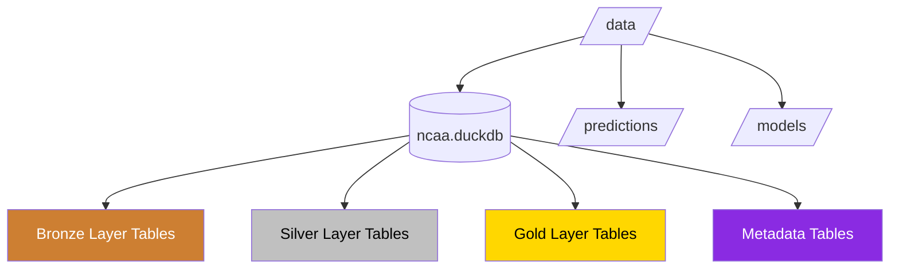

# Data Directory Structure

[TOC]

## Overview

This document outlines the organization of the data directory in the NCAA Basketball Analytics project. The approach uses DuckDB for all data layers (bronze, silver, and gold), maintaining medallion architecture principles with optimized storage efficiency.



## Directory Structure

```
ncaa-prediction-model/
└── data/
    ├── ncaa.duckdb            # DuckDB database containing all data layers
    │
    ├── predictions/           # Output prediction files
    │   └── YYYY-MM-DD/        # Organized by prediction date
    │
    └── models/                # Trained ML models
        └── model_name/        # Organized by model type
            └── version/       # Version-controlled model files
```

## Key Components

### 1. Bronze Layer (Raw Data)

The bronze layer preserves raw API data in DuckDB tables with original JSON content:

- **Table Naming**: Tables follow `bronze_{api_endpoint_name}` pattern
- **Data Preservation**: Original JSON stored in a `raw_data` column
- **Metadata Columns**: Each table includes ingestion timestamps, content hashes, and source information
- **Incremental Loading**: New data is appended to existing tables with appropriate tracking

Example schema for bronze layer tables:

```sql
CREATE TABLE bronze_scoreboard (
    id INTEGER PRIMARY KEY,
    date STRING,
    ingestion_timestamp TIMESTAMP,
    source_type STRING,
    content_hash STRING, -- For change detection
    raw_data STRING      -- Original JSON response
);

CREATE TABLE bronze_teams (
    id INTEGER PRIMARY KEY,
    team_id STRING,
    ingestion_timestamp TIMESTAMP,
    content_hash STRING,
    raw_data STRING
);
```

### 2. Metadata Registry

The DuckDB database contains metadata tables for tracking data lineage:

#### Metadata Tables

- **source_metadata**: Information about raw data sources
  - Links source ID to raw data and tracking information
  - Tracks content hashes, ingestion timestamps, and processing status
- **silver_dependencies**: Lineage from bronze to silver
- **gold_dependencies**: Lineage from silver to gold
- **model_dependencies**: Lineage from gold to models
- **job_history**: Processing job execution history
- **change_detection**: Change tracking for incremental processing

### 3. Silver and Gold Layers

The same DuckDB database contains normalized and feature-engineered tables:

#### Silver Layer Tables

Normalized entity tables derived from bronze data:

- **Table Naming**: Tables follow `silver_{entity_name}` pattern
- **seasons**: NCAA basketball seasons with dates and phases
- **teams**: Team information and metadata
- **players**: Player roster information
- **games**: Game events, results, and context
- **statistics**: Game and season statistics
- **venues**: Game locations
- **conferences**: Conference information
- **rankings**: Team rankings by poll

#### Gold Layer Tables

Feature-engineered tables derived from silver layer entities:

- **Table Naming**: Tables follow `gold_{feature_set_name}` pattern
- **team_performance**: Team level statistics, trends, and metrics
- **player_performance**: Player level statistics and metrics
- **game_context**: Game situation features (home/away, rest days, etc.)
- **historical_performance**: Historical matchups and outcomes
- **prediction_features**: Combined feature sets ready for model consumption

### 4. Predictions and Models

The remaining directories store prediction outputs and trained models:

- **predictions/**: Organized by prediction date
- **models/**: Organized by model type and version

## Storage Efficiency

Using DuckDB provides significant advantages:

1. **Single File**: All data stored in a single database file
2. **Columnar Storage**: Efficient storage and query performance
3. **SQL Interface**: Standard SQL access to all data layers
4. **Compression**: Automatic data compression for storage efficiency
5. **Integration**: Direct integration with Pandas, Polars, and other analytics libraries

## Access Patterns

Common data access patterns with DuckDB:

### Accessing Bronze Layer Data

```python
def read_scoreboard_data(date):
    """Read scoreboard data for a specific date."""
    with duckdb.connect("data/ncaa.duckdb") as conn:
        query = """
            SELECT raw_data
            FROM bronze_scoreboard
            WHERE date = ?
            ORDER BY ingestion_timestamp DESC
            LIMIT 1
        """
        result = conn.execute(query, [date]).fetchone()

        if result:
            # Parse the raw_data JSON
            return json.loads(result[0])
        else:
            return None
```

### Working with Silver Layer

```python
def get_team_games(team_id, season):
    """Get all games for a team in a season."""
    with duckdb.connect("data/ncaa.duckdb") as conn:
        return conn.execute("""
            SELECT * FROM silver_games
            WHERE (home_team_id = ? OR away_team_id = ?)
            AND season_id = ?
            ORDER BY game_date
        """, [team_id, team_id, season]).fetchdf()
```

## Data Pipeline Flow

The data pipeline follows this flow within the DuckDB database:

1. **Ingestion**:
   - Fetch data from ESPN APIs
   - Store in bronze layer tables with appropriate metadata
   - Update metadata registry

2. **Processing**:
   - Transform bronze layer data into silver layer normalized tables
   - Update lineage tracking

3. **Feature Engineering**:
   - Create features from silver tables
   - Store as gold layer tables
   - Update feature dependencies

4. **Analysis & Prediction**:
   - Use gold layer tables for model training
   - Generate predictions
   - Store models and predictions in respective directories

## Backup Strategy

The recommended backup strategy:

1. **Bronze Layer**: Regular filesystem backups of Parquet files (incremental)
2. **DuckDB Database**:
   - Regular database dumps using DuckDB's export functionality
   - Consider WAL-based backup for more frequent recovery points
3. **Models & Predictions**: Version control or filesystem backups
