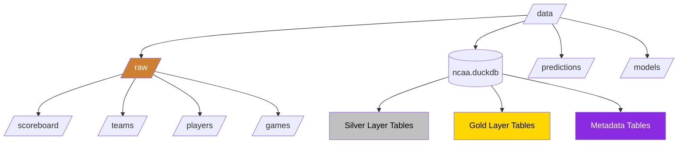

# Data Directory Structure

[TOC]

## Overview

This document outlines the organization of the data directory in the NCAA Basketball Analytics project after transitioning to DuckDB for the silver and gold layers. The updated approach simplifies the directory structure while maintaining the medallion architecture principles.



## Directory Structure

```
ncaa-prediction-model/
└── data/
    ├── raw/                       # Bronze layer: Raw JSON data from APIs
    │   ├── scoreboard/            # Scoreboard API data
    │   │   └── date=YYYYMMDD/     # Partitioned by date
    │   │       └── data.json
    │   ├── teams/                 # Teams API data
    │   │   └── season=YYYY-YY/    # Partitioned by season
    │   │       └── data.json
    │   ├── players/               # Players API data
    │   │   └── team=ID/           # Partitioned by team
    │   │       └── season=YYYY-YY/
    │   │           └── data.json
    │   └── games/                 # Game details API data
    │       └── game=ID/           # Partitioned by game ID
    │           └── data.json
    │
    ├── ncaa.duckdb                # Silver & Gold layers: Single DuckDB database
    │                              # Contains all normalized tables and features
    │
    ├── predictions/               # Output prediction files
    │   └── YYYY-MM-DD/            # Organized by prediction date
    │
    └── models/                    # Trained ML models
        └── model_name/            # Organized by model type
            └── version/           # Version-controlled model files
```

## Key Components

### 1. Raw Data (Bronze Layer)

The bronze layer preserves raw API data in its original JSON format:

- **Structured by Data Source**: Each API endpoint has its own directory
- **Logical Partitioning**: Data is partitioned by relevant dimensions (date, season, team, etc.)
- **Preservation**: Raw data is never modified once stored
- **Incremental Loading**: New data is added to the appropriate partition

Example of the raw data structure for the scoreboard endpoint:

```
data/raw/scoreboard/
├── date=20221101/
│   └── data.json
├── date=20221102/
│   └── data.json
...
└── date=20230415/
    └── data.json
```

### 2. DuckDB Database (Silver & Gold Layers)

A single DuckDB database (`data/ncaa.duckdb`) contains all silver and gold layer data:

#### Silver Layer Tables

Normalized entity tables derived from raw data:

- **seasons**: NCAA basketball seasons with dates and phases
- **teams**: Team information and metadata
- **players**: Player roster information
- **games**: Game events, results, and context
- **statistics**: Game and season statistics
- **venues**: Game locations
- **conferences**: Conference information
- **rankings**: Team rankings by poll

#### Gold Layer Tables

Feature-engineered tables derived from silver layer entities:

- **team_performance**: Team level statistics, trends, and metrics
- **player_performance**: Player level statistics and metrics
- **game_context**: Game situation features (home/away, rest days, etc.)
- **historical_performance**: Historical matchups and outcomes
- **prediction_features**: Combined feature sets ready for model consumption

#### Metadata Tables

Tables that track data lineage and metadata:

- **source_metadata**: Information about raw data sources
- **silver_dependencies**: Lineage from bronze to silver
- **gold_dependencies**: Lineage from silver to gold
- **model_dependencies**: Lineage from gold to models
- **job_history**: Processing job execution history
- **change_detection**: Change tracking for incremental processing

### 3. Predictions Directory

The predictions directory stores prediction outputs:

- Organized by prediction date
- Contains prediction results for various models and scenarios
- Used for analysis, visualization, and model evaluation

### 4. Models Directory

The models directory stores trained ML models:

- Organized by model type and version
- Contains model binaries, parameters, and performance metrics
- Facilitates model deployment and reproducibility

## Storage Efficiency

The updated structure provides significant storage efficiency improvements:

1. **Raw Data Preservation**: JSON files maintain their efficient partitioning
2. **Consolidated Storage**: DuckDB replaces hundreds of small Parquet files
3. **Compression**: DuckDB provides excellent compression for analytical data
4. **Reduced Overhead**: Eliminates per-file metadata overhead of many small files
5. **Simplified Queries**: Easier to query related data across entities

## Access Patterns

Common data access patterns with the updated structure:

### Accessing Raw Data

```python
def read_raw_scoreboard(date):
    """Read raw scoreboard data for a specific date."""
    file_path = f"data/raw/scoreboard/date={date}/data.json"
    with open(file_path) as f:
        return json.load(f)
```

### Querying Silver Layer

```python
def get_team_games(db_path, team_id, season):
    """Get all games for a team in a season."""
    with duckdb.connect(db_path) as conn:
        return conn.execute("""
            SELECT * FROM games
            WHERE (home_team_id = ? OR away_team_id = ?)
            AND season_id = ?
            ORDER BY game_date
        """, [team_id, team_id, season]).fetchdf()
```

### Working with Gold Layer Features

```python
def get_team_performance_features(db_path, team_id, last_n_games=10):
    """Get recent performance features for a team."""
    with duckdb.connect(db_path) as conn:
        return conn.execute("""
            SELECT * FROM team_performance
            WHERE team_id = ?
            ORDER BY game_date DESC
            LIMIT ?
        """, [team_id, last_n_games]).fetchdf()
```

## Migration Considerations

When migrating from the previous directory structure to the DuckDB-based approach:

1. **Raw Data**: Remains unchanged
2. **Silver Layer**:
   - Transform all processed Parquet files into DuckDB tables
   - Implement appropriate schema with foreign key constraints
3. **Gold Layer**:
   - Convert all feature Parquet files into DuckDB tables/views
   - Optimize for analytical query patterns
4. **Metadata Registry**:
   - Migrate from hierarchical Parquet files to DuckDB tables
   - Preserve all lineage relationships

## Backup Strategy

Recommended backup strategy for the updated directory structure:

1. **Raw Data**: Regular filesystem backups (incremental)
2. **DuckDB Database**:
   - Regular database dumps using DuckDB's export functionality
   - Consider WAL-based backup for more frequent recovery points
3. **Models**: Version control in git or filesystem backups
4. **Predictions**: Backup as needed based on importance
