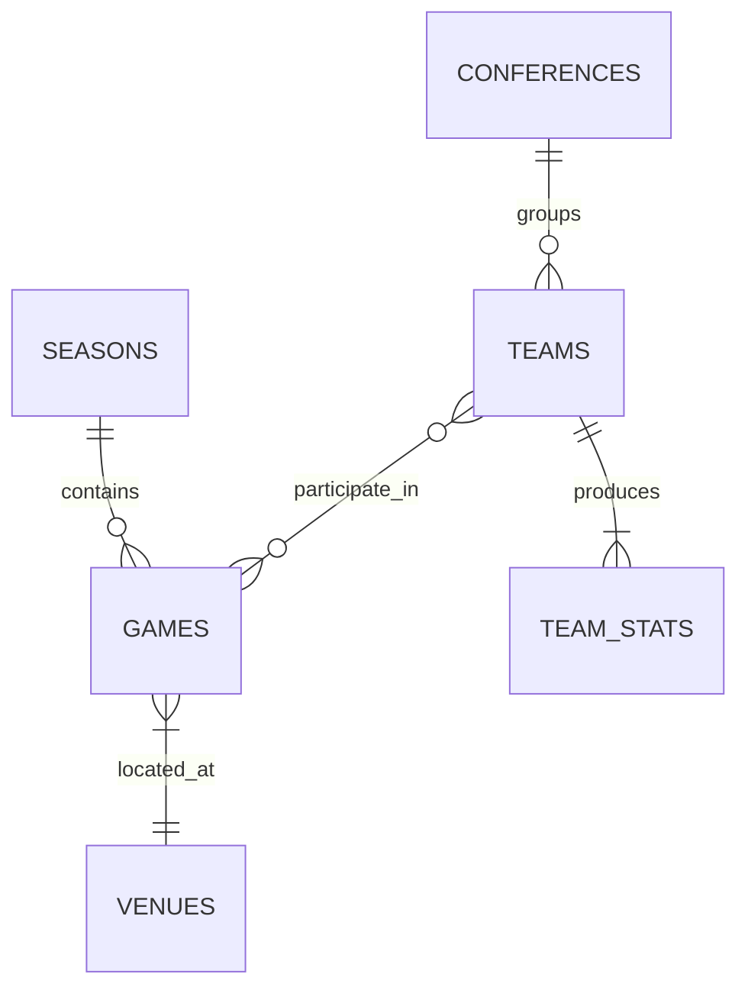

# Data Entities

[TOC]

This document describes the core data entities in the NCAA Basketball Prediction Model, focusing on the essential entities needed for the MVP.

## Entity Relationship Diagram

The following diagram shows the relationships between the core entities:



## Core Entities

### Teams

The Teams entity represents college basketball teams with their basic information.

#### Structure

| Field | Type | Description |
|-------|------|-------------|
| team_id | string | Unique identifier for the team (from ESPN) |
| name | string | Full team name |
| abbreviation | string | Team abbreviation |
| location | string | Team location |
| conference_id | string | Conference identifier |
| logo_url | string | URL to team logo |
| color | string | Primary team color |
| alternate_color | string | Secondary team color |

#### Example

```json
{
  "team_id": "150",
  "name": "Duke Blue Devils",
  "abbreviation": "DUKE",
  "location": "Durham",
  "conference_id": "2",
  "logo_url": "https://a.espncdn.com/i/teamlogos/ncaa/500/150.png",
  "color": "#001A57",
  "alternate_color": "#FFFFFF"
}
```

### Games

The Games entity represents basketball games, including schedule and score information.

#### Structure

| Field | Type | Description |
|-------|------|-------------|
| game_id | string | Unique identifier for the game (from ESPN) |
| season_id | string | Season identifier (e.g., "2022-23") |
| season_type | integer | Season type (1=regular season, 2=conference tourney, 3=NCAA tournament) |
| date | datetime | Date and time of the game |
| home_team_id | string | Home team identifier |
| away_team_id | string | Away team identifier |
| venue_id | string | Venue identifier |
| home_score | integer | Home team score (null if not played) |
| away_score | integer | Away team score (null if not played) |
| status | string | Game status (scheduled, in_progress, final) |
| neutral_site | boolean | Whether game is played at a neutral site |
| conference_game | boolean | Whether this is a conference game |

#### Example

```json
{
  "game_id": "401468245",
  "season_id": "2022-23",
  "season_type": 1,
  "date": "2023-01-14T19:00:00Z",
  "home_team_id": "150",
  "away_team_id": "152",
  "venue_id": "3677",
  "home_score": 68,
  "away_score": 63,
  "status": "final",
  "neutral_site": false,
  "conference_game": true
}
```

### Team Statistics

The Team Statistics entity captures team performance metrics for games.

#### Structure

| Field | Type | Description |
|-------|------|-------------|
| team_id | string | Team identifier |
| game_id | string | Game identifier |
| season_id | string | Season identifier |
| points | integer | Total points scored |
| field_goals_made | integer | Field goals made |
| field_goals_attempted | integer | Field goals attempted |
| field_goal_pct | float | Field goal percentage |
| three_point_made | integer | Three-point shots made |
| three_point_attempted | integer | Three-point shots attempted |
| three_point_pct | float | Three-point percentage |
| free_throws_made | integer | Free throws made |
| free_throws_attempted | integer | Free throws attempted |
| free_throw_pct | float | Free throw percentage |
| rebounds | integer | Total rebounds |
| offensive_rebounds | integer | Offensive rebounds |
| defensive_rebounds | integer | Defensive rebounds |
| assists | integer | Total assists |
| steals | integer | Total steals |
| blocks | integer | Total blocks |
| turnovers | integer | Total turnovers |
| fouls | integer | Total fouls |

### Conferences

The Conferences entity represents college basketball conferences.

#### Structure

| Field | Type | Description |
|-------|------|-------------|
| conference_id | string | Unique identifier for the conference |
| name | string | Conference name |
| short_name | string | Conference short name/abbreviation |
| logo_url | string | URL to conference logo |

### Seasons

The Seasons entity tracks NCAA basketball seasons.

#### Structure

| Field | Type | Description |
|-------|------|-------------|
| season_id | string | Unique identifier for the season (e.g., "2022-23") |
| name | string | Season name |
| start_date | date | Season start date |
| end_date | date | Season end date |
| year | integer | Season year (e.g., 2023 for 2022-23 season) |

### Venues

The Venues entity represents locations where games are played.

#### Structure

| Field | Type | Description |
|-------|------|-------------|
| venue_id | string | Unique identifier for the venue |
| name | string | Venue name |
| capacity | integer | Venue capacity |
| city | string | City name |
| state | string | State abbreviation |
| country | string | Country |

## Implementation

These entities are implemented as tables in DuckDB with appropriate data types and relationships in the silver layer, following the `silver_{entity_name}` naming convention.

### Example SQL Schema

```sql
-- Teams table
CREATE TABLE silver_teams (
    team_id VARCHAR PRIMARY KEY,
    name VARCHAR NOT NULL,
    abbreviation VARCHAR,
    location VARCHAR,
    conference_id VARCHAR REFERENCES silver_conferences(conference_id),
    logo_url VARCHAR,
    color VARCHAR,
    alternate_color VARCHAR
);

-- Games table
CREATE TABLE silver_games (
    game_id VARCHAR PRIMARY KEY,
    season_id VARCHAR REFERENCES silver_seasons(season_id),
    season_type INTEGER,
    date TIMESTAMP NOT NULL,
    home_team_id VARCHAR REFERENCES silver_teams(team_id),
    away_team_id VARCHAR REFERENCES silver_teams(team_id),
    venue_id VARCHAR REFERENCES silver_venues(venue_id),
    home_score INTEGER,
    away_score INTEGER,
    status VARCHAR,
    neutral_site BOOLEAN,
    conference_game BOOLEAN
);
```

## Data Access Patterns

For the MVP, the following access patterns are prioritized:

1. Retrieve team information by ID
2. Get all games for a specific team
3. Get team statistics for a game
4. Get historical matchups between two teams
5. Filter games by date range or season

These patterns inform the database schema design and API implementation.
