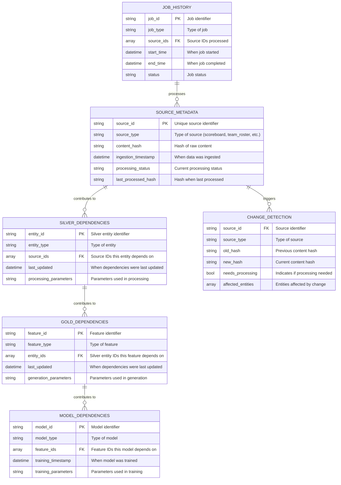
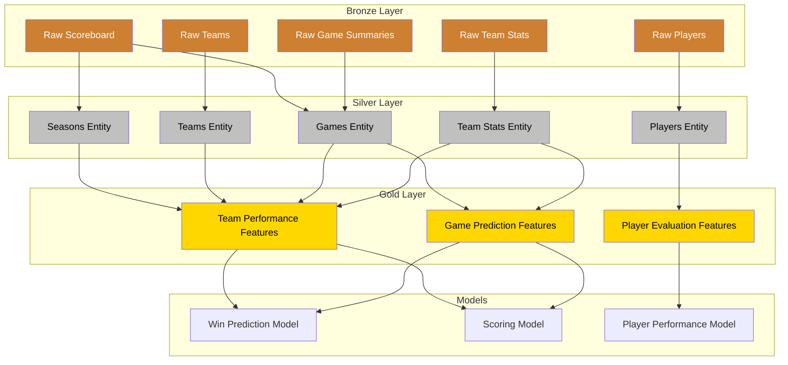
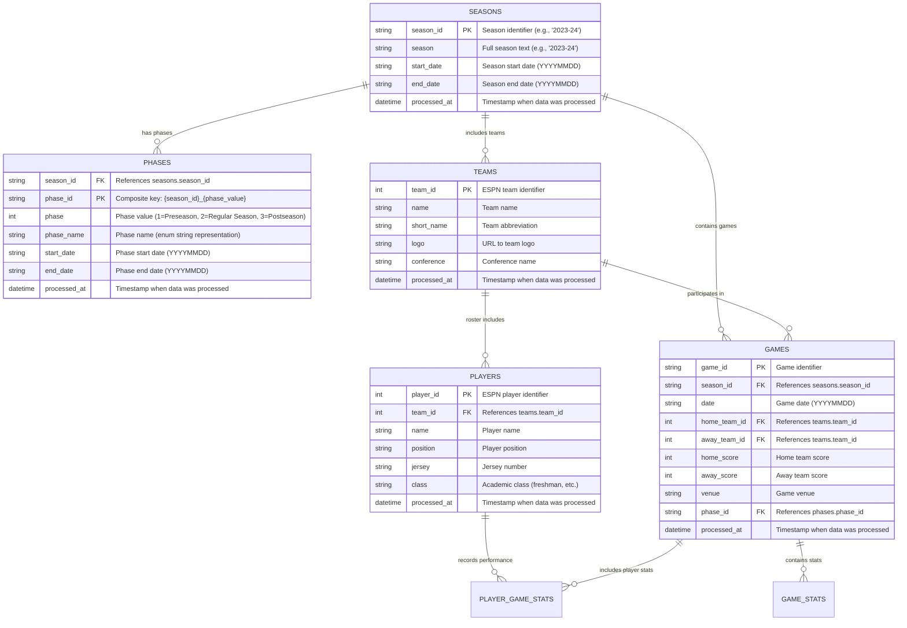
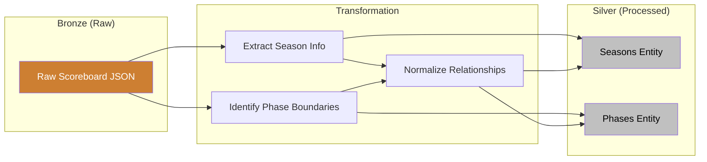

# Data Entity Model

[TOC]

## Overview

This document outlines the entity model for the NCAA Basketball Analytics project, following the medallion architecture
approach (Bronze, Silver, Gold layers). The entity model for the Silver layer follows a normalized database design
approach, with clear entity boundaries and relationships defined through foreign keys.

!!! info "Medallion Layer Focus"
    This document primarily focuses on the **Silver Layer** entities, which represent the
    cleaned, transformed data in a normalized structure ready for feature engineering.

## Metadata Registry

The project implements a comprehensive metadata registry that tracks data sources, transformations, and lineage across all medallion layers. This registry is a critical component that enables reproducibility, impact analysis, and efficient change detection.



### Metadata Registry Structure

The metadata registry is organized hierarchically:

```
data/
├── _registry/
│   ├── sources/                   # Raw data source metadata
│   │   ├── scoreboard/
│   │   │   └── 2023.parquet       # All 2023 scoreboard metadata
│   │   ├── team_rosters/
│   │   │   └── 2023.parquet       # All 2023 roster metadata
│   │   ├── teams/
│   │   │   └── 2023.parquet       # All 2023 teams metadata
│   │   ├── players/
│   │   │   └── 2023.parquet       # All 2023 players metadata
│   │   ├── team_stats/
│   │   │   └── 2023.parquet       # All 2023 team statistics metadata
│   │   ├── game_summaries/
│   │   │   └── 2023.parquet       # All 2023 game summaries metadata
│   │   ├── rankings/
│   │   │   └── 2023.parquet       # All 2023 rankings metadata
│   │   └── standings/
│   │       └── 2023.parquet       # All 2023 standings metadata
│   ├── lineage/                   # Tracks data relationships
│   │   ├── silver_dependencies/   # Raw → Silver dependencies
│   │   │   ├── seasons.parquet
│   │   │   ├── teams.parquet
│   │   │   ├── games.parquet
│   │   │   ├── players.parquet
│   │   │   └── statistics.parquet
│   │   ├── gold_dependencies/     # Silver → Gold dependencies
│   │   │   ├── team_performance.parquet
│   │   │   ├── player_statistics.parquet
│   │   │   └── game_predictions.parquet
│   │   └── model_dependencies/    # Gold → Model dependencies
│   │       ├── win_predictor.parquet
│   │       ├── scoring_model.parquet
│   │       └── player_performance.parquet
│   └── processing/                # Processing status tracking
│       ├── job_history/           # Historical record of processing jobs
│       │   ├── 2023.parquet       # All 2023 processing jobs
│       │   └── 2022.parquet       # All 2022 processing jobs
│       └── delta_tracking/        # Track changes requiring processing
│           └── changed_sources.parquet
```

### Metadata Components

#### 1. Source Metadata

Tracks information about each raw data source:

| Field                | Type     | Description                                        |
| -------------------- | -------- | -------------------------------------------------- |
| `source_id`          | string   | Unique identifier for the source                   |
| `source_type`        | string   | Type of source (scoreboard, team_roster, etc.)     |
| `content_hash`       | string   | Hash of raw content for change detection           |
| `ingestion_timestamp`| datetime | When the data was ingested                         |
| `size_bytes`         | integer  | Size of the raw data                               |
| `api_version`        | string   | Version of the API if available                    |
| `endpoint`           | string   | Full endpoint path                                 |
| `parameters`         | string   | API parameters used (JSON string)                  |
| `last_processed`     | datetime | When the data was last processed                   |
| `processing_status`  | string   | Current processing status                          |
| `error_message`      | string   | Error message if processing failed                 |
| `last_processed_hash`| string   | Content hash when last processed                   |

**Storage Location**: `data/_registry/sources/{source_type}/{year}.parquet`

#### 2. Lineage Tracking

Tracks relationships between entities across layers:

**Silver Dependencies**:

| Field                 | Type     | Description                                 |
| --------------------- | -------- | ------------------------------------------- |
| `entity_id`           | string   | Silver entity identifier                    |
| `entity_type`         | string   | Type of entity (seasons, teams, etc.)       |
| `source_ids`          | array    | List of source_ids this entity depends on   |
| `last_updated`        | datetime | When the dependencies were last updated     |
| `processor_version`   | string   | Version of the processor                    |
| `processing_parameters`| string   | Parameters used for processing (JSON string)|

**Storage Location**: `data/_registry/lineage/silver_dependencies/{entity_type}.parquet`

**Gold Dependencies**:

| Field                 | Type     | Description                                  |
| --------------------- | -------- | -------------------------------------------- |
| `feature_id`          | string   | Feature identifier                           |
| `feature_type`        | string   | Type of feature                              |
| `entity_ids`          | array    | List of entity_ids this feature depends on   |
| `last_updated`        | datetime | When the dependencies were last updated      |
| `generator_version`   | string   | Version of the feature generator             |
| `generation_parameters`| string   | Parameters used for generation (JSON string) |

**Storage Location**: `data/_registry/lineage/gold_dependencies/{feature_type}.parquet`

**Model Dependencies**:

| Field                | Type     | Description                               |
| -------------------- | -------- | ----------------------------------------- |
| `model_id`           | string   | Model identifier                          |
| `model_type`         | string   | Type of model                             |
| `feature_ids`        | array    | List of feature_ids this model depends on |
| `training_timestamp` | datetime | When the model was trained                |
| `model_version`      | string   | Version of the model                      |
| `training_parameters`| string   | Parameters used for training (JSON string)|

**Storage Location**: `data/_registry/lineage/model_dependencies/{model_type}.parquet`

#### 3. Processing Status

Tracks job execution and change detection:

**Job History**:

| Field          | Type     | Description                             |
| -------------- | -------- | --------------------------------------- |
| `job_id`       | string   | Unique identifier for the job           |
| `job_type`     | string   | Type of job (ingest, transform, etc.)   |
| `source_type`  | string   | Type of source processed                |
| `start_time`   | datetime | When the job started                    |
| `end_time`     | datetime | When the job completed                  |
| `status`       | string   | Status (success, failed, etc.)          |
| `source_ids`   | array    | List of source_ids processed            |
| `error_message`| string   | Error message if job failed             |

**Storage Location**: `data/_registry/processing/job_history/{year}.parquet`

**Change Detection**:

| Field              | Type     | Description                              |
| ------------------ | -------- | ---------------------------------------- |
| `source_id`        | string   | Source identifier                        |
| `source_type`      | string   | Type of source                           |
| `detection_time`   | datetime | When the change was detected             |
| `old_hash`         | string   | Previous content hash                    |
| `new_hash`         | string   | Current content hash                     |
| `needs_processing` | boolean  | Flag indicating if processing is needed  |
| `affected_entities`| array    | List of entities affected by this change |

**Storage Location**: `data/_registry/processing/delta_tracking/changed_sources.parquet`

### Lineage Tracing and Impact Analysis

The metadata registry enables tracing data lineage through all layers:



This enables powerful lineage and impact analysis queries:

1. **Source-to-Model Tracing**: Track which raw sources contribute to any given model
2. **Change Impact Analysis**: Identify all downstream entities affected by changes to source data
3. **Failure Analysis**: Identify processing failures and their impact
4. **Incremental Processing**: Efficiently identify which sources need reprocessing
5. **Data Provenance**: Document the complete history of how any model or feature was created

### Key Metadata Registry Operations

The registry supports several critical operations:

#### Change Detection

```python
def detect_changes() -> list[str]:
    """Find sources that have changed since last processing."""
    # Identify sources where content_hash != last_processed_hash
    # Return list of source_ids requiring reprocessing
```

#### Lineage Tracing

```python
def trace_upstream(entity_id: str) -> list[str]:
    """Trace upstream to find all source data dependencies."""
    # For Silver entities: find all sources they depend on
    # For Gold features: find all silver entities, then their sources
    # For Models: trace through features, entities, to sources
```

#### Impact Analysis

```python
def analyze_impact(source_ids: list[str]) -> dict:
    """Analyze downstream impact of changes to sources."""
    # For given sources, find all dependent entities
    # For those entities, find dependent features
    # For those features, find dependent models
    # Return complete impact assessment
```

## Silver Layer Entity Model



## Current Silver Layer Entities

The processed (silver) layer currently consists of these core entities:

### Seasons

The `seasons` entity represents NCAA basketball seasons:

| Field          | Type     | Description                                      |
| -------------- | -------- | ------------------------------------------------ |
| `season_id`    | string   | Primary key, season identifier (e.g., "2023-24") |
| `season`       | string   | Full season text (e.g., "2023-24")               |
| `start_date`   | string   | Season start date in YYYYMMDD format             |
| `end_date`     | string   | Season end date in YYYYMMDD format               |
| `processed_at` | datetime | Timestamp when the data was processed            |

**Storage Location**: `data/processed/calendar/seasons.parquet`

### Phases

The `phases` entity represents the distinct phases within each basketball season:

| Field          | Type     | Description                                               |
| -------------- | -------- | --------------------------------------------------------- |
| `season_id`    | string   | Foreign key to seasons.season_id                          |
| `phase_id`     | string   | Primary key, composite key: {season_id}\_{phase_value}    |
| `phase`        | integer  | Phase value (1=Preseason, 2=Regular Season, 3=Postseason) |
| `phase_name`   | string   | Phase name (enum string representation)                   |
| `start_date`   | string   | Phase start date in YYYYMMDD format                       |
| `end_date`     | string   | Phase end date in YYYYMMDD format                         |
| `processed_at` | datetime | Timestamp when the data was processed                     |

**Storage Location**: `data/processed/calendar/phases.parquet`

## Medallion Layer Storage Structure

The project uses a structured approach for organizing data across the medallion layers:

```
data/
├── raw/                  # Bronze Layer
│   ├── scoreboard/       # Partitioned by date (YYYYMMDD)
│   ├── teams/            # Team data
│   └── games/            # Game-specific data
│
├── processed/            # Silver Layer
│   ├── calendar/         # Calendar-related entities
│   │   ├── seasons.parquet
│   │   └── phases.parquet
│   ├── teams/            # Team entities
│   ├── players/          # Player entities
│   └── games/            # Game entities
│
└── features/             # Gold Layer
    ├── team_performance/ # Team-related features
    ├── game_context/     # Game-specific features
    └── combined/         # Combined feature sets
```

## Implementation Principles

!!! note "Silver Layer Design Principles" The Silver layer entity model follows these core principles:

- **Normalization**: Entities are normalized to eliminate redundancy
- **Foreign Key Relationships**: Explicit relationships are maintained through foreign keys
- **Clear Entity Boundaries**: Each entity has a well-defined purpose and scope
- **Efficient Storage**: Parquet files with appropriate partitioning for optimal performance
- **Data Preservation**: Each entity maintains complete historical records with timestamps

## Future Entity Extensions

As additional ESPN API endpoints are processed, the entity model will expand to include:

### Teams Entity (Planned)

Will store information about basketball teams:

- Team ID (Primary Key)
- Team name, conference, location
- Relationships to seasons, conferences

### Players Entity (Planned)

Will store information about players:

- Player ID (Primary Key)
- Player name, position, biographic information
- Relationships to teams

### Games Entity (Planned)

Will store game metadata:

- Game ID (Primary Key)
- Date, venue, attendance information
- Relationships to teams, seasons, and phases

### Game Statistics Entity (Planned)

Will store performance statistics:

- Game ID, Team ID (Composite Foreign Key)
- Team-level performance metrics
- Relationships to games and teams

### Player Game Statistics Entity (Planned)

Will store player performance in games:

- Game ID, Player ID (Composite Foreign Key)
- Individual performance metrics
- Relationships to games and players

## Entity Model Growth Strategy

The entity model will grow organically as new data sources are integrated:

1. **Vertical Growth**: Adding new attributes to existing entities as needed
1. **Horizontal Growth**: Adding new entities for new data domains
1. **Relationship Enhancement**: Refining relationships between entities as data understanding improves

All growth will maintain the core principles of normalized design and explicit relationships.

## Bronze to Silver Transformation

!!! tip "Data Transformation" The transformation from Bronze to Silver layer follows these steps:



## Version Control

Changes to the entity model will be tracked through a versioning strategy:

1. **Documentation Updates**: This document will be updated as the model evolves
1. **Migration Scripts**: When breaking changes occur, migration scripts will be provided
1. **Change Logs**: Major changes will be documented in a dedicated change log

## Related Documentation

- [Data Pipeline](data-pipeline.md): Details of the ingestion and processing pipeline
- [Feature Engineering](feature-engineering.md): How Silver layer entities are used for feature creation
- [Project Architecture](index.md): Overall architectural overview
