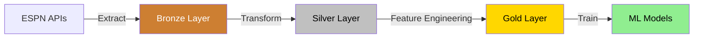

# Data Pipeline

This document describes the data pipeline for the NCAA Basketball Prediction Model, focusing on the MVP implementation.

## Overview

The data pipeline follows the medallion architecture pattern with three sequential processing layers:



## Data Sources

The project uses ESPN's undocumented APIs to retrieve NCAA basketball data:

### Primary Endpoints (MVP)

- **Scoreboard API**: Game schedules, scores, and basic game information
  - URL: `https://site.api.espn.com/apis/site/v2/sports/basketball/mens-college-basketball/scoreboard`
  - Parameters: `dates`, `groups` (conferences), `limit`

- **Teams API**: Team information and metadata
  - URL: `https://site.api.espn.com/apis/site/v2/sports/basketball/mens-college-basketball/teams/{team_id}`

## Ingestion Architecture

The project uses a flexible, extensible ingestion architecture based on abstract base classes:

### Core Components

1. **BaseIngestionConfig**: Abstract configuration class that defines common parameters for all ingestion operations:
   ```python
   @dataclass
   class BaseIngestionConfig:
       # API configuration
       espn_api_config: ESPNApiConfig

       # Data storage configuration
       parquet_dir: str = ""

       # Processing options
       force_check: bool = False  # Force API requests and check if data changed
       force_overwrite: bool = False  # Force overwrite existing data

       # Concurrency options
       concurrency: Optional[int] = None
   ```

2. **BaseIngestion**: Abstract base class that standardizes ingestion patterns across all data sources:
   ```python
   class BaseIngestion(Generic[T], ABC):
       """Abstract base class for all data ingestion implementations."""

       def __init__(self, config: BaseIngestionConfig) -> None:
           # Initialize with configuration

       @abstractmethod
       async def fetch_item_async(self, item_key: T) -> Dict[str, Any]:
           """Fetch data for a specific item asynchronously."""
           pass

       @abstractmethod
       async def store_item_async(self, item_key: T, data: Dict[str, Any]) -> Dict[str, Any]:
           """Store data for a specific item asynchronously."""
           pass

       @abstractmethod
       def get_processed_items(self) -> List[T]:
           """Get list of items that have already been processed."""
           pass

       @abstractmethod
       def determine_items_to_process(self) -> List[T]:
           """Determine which items to process based on configuration."""
           pass

       async def ingest_async(self) -> List[T]:
           """Run the ingestion process asynchronously."""
           # Implementation that orchestrates the ingestion process
   ```

### Endpoint-Specific Implementations

Each data source has its own implementation that extends the base classes:

#### Scoreboard Ingestion

```python
@dataclass
class ScoreboardIngestionConfig(BaseIngestionConfig):
    """Configuration for scoreboard data ingestion."""
    # Date selection parameters (only one should be used)
    date: Optional[str] = None
    start_date: Optional[str] = None
    end_date: Optional[str] = None
    yesterday: bool = False
    today: bool = False
    seasons: Optional[List[str]] = None
    year: Optional[int] = None

class ScoreboardIngestion(BaseIngestion[str]):
    """Scoreboard data ingestion from ESPN API."""

    async def fetch_item_async(self, date: str) -> Dict[str, Any]:
        """Fetch scoreboard data for a specific date asynchronously."""
        # Implementation

    async def store_item_async(self, date: str, data: Dict[str, Any]) -> Dict[str, Any]:
        """Store scoreboard data for a specific date."""
        # Implementation
```

#### Teams Ingestion

```python
@dataclass
class TeamsIngestionConfig(BaseIngestionConfig):
    """Configuration for teams data ingestion."""
    # Season parameters
    seasons: Optional[List[str]] = None

    # Optional filters
    conference: Optional[str] = None

    # Pagination parameters
    limit: int = 100
    page: int = 1

class TeamsIngestion(BaseIngestion[str]):
    """Teams data ingestion from ESPN API."""

    async def fetch_item_async(self, season: str) -> Dict[str, Any]:
        """Fetch teams data for a specific season asynchronously."""
        # Implementation

    async def store_item_async(self, season: str, data: Dict[str, Any]) -> Dict[str, Any]:
        """Store teams data for a specific season."""
        # Implementation
```

### Unified Ingestion

For ingesting data from multiple endpoints concurrently:

```python
@dataclass
class UnifiedIngestionConfig(BaseIngestionConfig):
    """Configuration for unified multi-endpoint ingestion."""
    # Endpoints to ingest
    endpoints: List[str] = None

    # Endpoint-specific parameters
    # [All parameters from endpoint-specific configs]

    # Global concurrency control
    max_parallel_endpoints: int = 2

async def ingest_multiple_endpoints(config: UnifiedIngestionConfig) -> Dict[str, List[str]]:
    """Ingest data from multiple ESPN API endpoints."""
    # Implementation that coordinates ingestion across multiple endpoints
```

## Bronze Layer

The Bronze layer preserves raw data from ESPN APIs in its original form.

### Implementation

1. **Storage Format**: Partitioned Parquet files using year-month partitioning scheme
2. **Directory Structure**:
   ```
   data/raw/{endpoint}/year=YYYY/month=MM/*.parquet
   ```
3. **Data Preservation**: Original JSON stored in a `raw_data` column along with metadata
4. **Schema Design**:
   ```python
   schema = {
       "id": Int32,                # Record identifier
       "date": String,             # Date in YYYY-MM-DD format
       "source_url": String,       # API endpoint URL
       "parameters": String,       # Query parameters as JSON string
       "content_hash": String,     # Content hash for change detection
       "raw_data": String,         # Original JSON response
       "created_at": Timestamp,    # Ingestion timestamp
       "year": String,             # Partition value
       "month": String             # Partition value
   }
   ```
5. **Compression**: ZSTD compression for optimal storage efficiency
6. **Metadata Tracking**: Additional columns for request parameters, hash values, and lineage tracking

## Silver Layer

The Silver layer transforms raw data into cleaned, normalized structures.

### Core Entities

- **Teams**: Team information and metadata
- **Games**: Game schedules, scores, and outcomes
- **Seasons**: Season definitions and timeframes
- **Conferences**: Conference groupings and membership

### Implementation

1. **Storage Format**: DuckDB tables with `silver_{entity_name}` naming convention
2. **Transformation Process**:
   - Read JSON data from bronze layer Parquet files
   - Apply data type conversions
   - Normalize nested structures
   - Implement data validation
   - Create relationships between entities
3. **Data Lineage**: Track source records from bronze layer to maintain data provenance

## Gold Layer

The Gold layer generates features for machine learning models.

### MVP Features

1. **Team Performance**:
   - Win/loss record (overall, home/away, conference)
   - Scoring statistics (points per game, points allowed, margin)
   - Streaks (winning, losing, home, away)
   - Recent performance (last N games)

2. **Game Context**:
   - Home/away/neutral site
   - Days rest
   - Travel distance
   - Tournament/regular season

3. **Historical Matchups**:
   - Head-to-head record
   - Previous game results

### Implementation

1. **Storage Format**: DuckDB tables with `gold_{feature_set_name}` naming convention
2. **Feature Generation Process**:
   - Extract from silver layer tables
   - Calculate derived features
   - Apply feature transformations (scaling, encoding)
   - Organize into feature sets for model training

## Usage Patterns

### Running Ingestion Operations

#### Single Endpoint Ingestion

```python
from src.ingest import ScoreboardIngestionConfig, ingest_scoreboard

# Create configuration
config = ScoreboardIngestionConfig(
    espn_api_config=get_config().espn_api,
    date="2023-03-15",
    force_check=True,
    concurrency=5
)

# Run ingestion
processed_items = ingest_scoreboard(config)
```

#### Multi-Endpoint Ingestion

```python
from src.ingest import UnifiedIngestionConfig, ingest_all

# Create configuration for multiple endpoints
config = UnifiedIngestionConfig(
    espn_api_config=get_config().espn_api,
    endpoints=["scoreboard", "teams"],
    date="2023-03-15",
    seasons=["2023"],
    max_parallel_endpoints=2
)

# Run ingestion for all specified endpoints
results = ingest_all(config)
```

### Processing Operations

```python
from src.process import process_bronze_to_silver

# Process raw data for games entity
processed_items = process_bronze_to_silver(
    entity="games",
    date_range=("2023-01-01", "2023-01-31"),
    incremental=True
)
```

### Feature Engineering

```python
from src.features import generate_team_performance_features

# Generate team performance features
features = generate_team_performance_features(
    season="2023",
    lookback_games=10
)
```

## Monitoring and Logging

All pipeline operations implement structured logging with contextual metadata:

```
2023-05-01T15:30:45.123Z [INFO] Fetching scoreboard data for date date=2023-03-15
2023-05-01T15:30:46.456Z [INFO] Stored scoreboard data successfully date=2023-03-15 file_path=data/raw/scoreboard/year=2023/month=03/scoreboard-2023-03-15.parquet item_count=67
```

This provides traceability across pipeline stages and enables effective monitoring and debugging.
