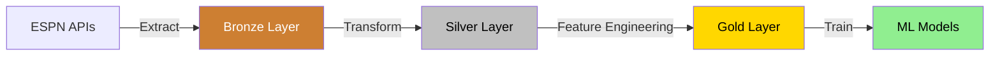

# Data Pipeline

This document describes the data pipeline for the NCAA Basketball Prediction Model, focusing on the MVP implementation.

## Overview

The data pipeline follows the medallion architecture pattern with three sequential processing layers:



## Data Sources

The project uses ESPN's undocumented APIs to retrieve NCAA basketball data:

### Primary Endpoints (MVP)

- **Scoreboard API**: Game schedules, scores, and basic game information
  - URL: `https://site.api.espn.com/apis/site/v2/sports/basketball/mens-college-basketball/scoreboard`
  - Parameters: `dates`, `groups` (conferences), `limit`

- **Teams API**: Team information and metadata
  - URL: `https://site.api.espn.com/apis/site/v2/sports/basketball/mens-college-basketball/teams/{team_id}`

### Request Implementation

```python
def fetch_scoreboard(date: str, limit: int = 100) -> dict:
    """
    Fetch scoreboard data for a specific date.

    Args:
        date: Date in YYYYMMDD format
        limit: Maximum number of games to return

    Returns:
        JSON response as dictionary
    """
    url = "https://site.api.espn.com/apis/site/v2/sports/basketball/mens-college-basketball/scoreboard"
    params = {
        "dates": date,
        "limit": limit
    }

    response = requests.get(url, params=params)
    response.raise_for_status()

    return response.json()
```

## Bronze Layer

The Bronze layer preserves raw data from ESPN APIs in its original form.

### Implementation

1. **Storage Format**: Partitioned Parquet files using year-month partitioning scheme
2. **Directory Structure**: 
   ```
   data/raw/{endpoint}/year=YYYY/month=MM/*.parquet
   ```
3. **Data Preservation**: Original JSON stored in a `raw_data` column along with metadata
4. **Schema Design**:
   ```python
   schema = {
       "id": Int32,                # Record identifier
       "date": String,             # Date in YYYY-MM-DD format
       "source_url": String,       # API endpoint URL
       "parameters": String,       # Query parameters as JSON string
       "content_hash": String,     # Content hash for change detection
       "raw_data": String,         # Original JSON response
       "created_at": Timestamp,    # Ingestion timestamp
       "year": String,             # Partition value
       "month": String             # Partition value
   }
   ```
5. **Compression**: ZSTD compression for optimal storage efficiency (year-month partitioning provides ~74% reduction compared to DuckDB)
6. **Metadata Tracking**: Additional columns for request parameters, hash values, and lineage tracking

### Bronze Layer Ingestion Example

```python
def ingest_scoreboard(date, response_data):
    """
    Store raw scoreboard data in the bronze layer.
    
    Args:
        date: Date in YYYY-MM-DD format
        response_data: Raw API response
    """
    # Extract year and month for partitioning
    year, month, _ = date.split('-')
    
    # Create directory structure if needed
    partition_dir = f"data/raw/scoreboard/year={year}/month={month}"
    os.makedirs(partition_dir, exist_ok=True)
    
    # Calculate content hash for change detection
    content_hash = hashlib.md5(json.dumps(response_data).encode()).hexdigest()
    
    # Create record with metadata
    record = {
        "id": None,  # Will be assigned automatically
        "date": date,
        "source_url": "https://site.api.espn.com/apis/site/v2/sports/basketball/mens-college-basketball/scoreboard",
        "parameters": json.dumps({"dates": date.replace('-', '')}),
        "content_hash": content_hash,
        "raw_data": json.dumps(response_data),
        "created_at": datetime.now(),
        "year": year,
        "month": month
    }
    
    # Create DataFrame and write to parquet partition
    df = pl.DataFrame([record])
    output_path = f"{partition_dir}/scoreboard-{date}.parquet"
    df.write_parquet(output_path)
    
    # Update metadata registry in DuckDB
    with duckdb.connect("data/ncaa.duckdb") as conn:
        conn.execute("""
            INSERT INTO source_metadata (
                source_type, source_date, file_path, 
                content_hash, processed, ingestion_timestamp
            ) VALUES (?, ?, ?, ?, ?, ?)
        """, ["scoreboard", date, output_path, content_hash, False, datetime.now()])
```

## Silver Layer

The Silver layer transforms raw data into cleaned, normalized structures.

### Core Entities

- **Teams**: Team information and metadata
- **Games**: Game schedules, scores, and outcomes
- **Seasons**: Season definitions and timeframes
- **Conferences**: Conference groupings and membership

### Implementation

1. **Storage Format**: DuckDB tables with `silver_{entity_name}` naming convention
2. **Transformation Process**:
   - Read JSON data from bronze layer Parquet files
   - Apply data type conversions
   - Normalize nested structures
   - Implement data validation
   - Create relationships between entities
3. **Data Lineage**: Track source records from bronze layer to maintain data provenance

### Example Transformation

```python
def process_games(date):
    """
    Process raw scoreboard data into normalized game records.

    Args:
        date: Date in YYYY-MM-DD format
    
    Returns:
        List of normalized game dictionaries
    """
    # Extract year and month for loading bronze data
    year, month, _ = date.split('-')
    
    # Path to the bronze layer partition
    bronze_path = f"data/raw/scoreboard/year={year}/month={month}"
    
    # Load the raw data from parquet
    try:
        df = pl.read_parquet(
            bronze_path, 
            filters=[pl.col("date") == date]
        )
        
        if len(df) == 0:
            return []
            
        # Get the most recent record for this date
        raw_data = json.loads(df.sort("created_at", descending=True)[0, "raw_data"])
    except Exception as e:
        logger.error(f"Error loading bronze data: {e}")
        return []
    
    games = []
    
    for event in raw_data.get("events", []):
        game_id = event.get("id")
        competitions = event.get("competitions", [])

        if not competitions:
            continue

        competition = competitions[0]

        # Extract teams and scores
        teams_data = {}
        for competitor in competition.get("competitors", []):
            is_home = competitor.get("homeAway") == "home"
            team_id = competitor.get("team", {}).get("id")
            score = competitor.get("score")

            role = "home" if is_home else "away"
            teams_data[role] = {
                "team_id": team_id,
                "score": int(score) if score else None
            }

        # Create normalized game record
        game = {
            "game_id": game_id,
            "date": event.get("date"),
            "status": competition.get("status", {}).get("type", {}).get("name"),
            "home_team_id": teams_data.get("home", {}).get("team_id"),
            "away_team_id": teams_data.get("away", {}).get("team_id"),
            "home_score": teams_data.get("home", {}).get("score"),
            "away_score": teams_data.get("away", {}).get("score"),
            "neutral_site": competition.get("neutralSite", False),
            "conference_game": competition.get("conferenceCompetition", False)
        }

        games.append(game)

    return games
```

## Gold Layer

The Gold layer generates features for machine learning models.

### MVP Features

1. **Team Performance**:
   - Win/loss record (overall, home/away, conference)
   - Scoring averages (points for/against)
   - Recent performance (last 5/10 games)

2. **Game Context**:
   - Home/away/neutral
   - Days of rest
   - Conference matchup
   - Historical matchup results

### Implementation

```python
def calculate_team_features(team_id: str, games: List[dict]) -> dict:
    """
    Calculate team performance features from game data.

    Args:
        team_id: Team identifier
        games: List of processed game dictionaries

    Returns:
        Dictionary of team features
    """
    team_games = [g for g in games if g["home_team_id"] == team_id or g["away_team_id"] == team_id]

    # Calculate overall record
    wins = 0
    losses = 0
    points_for = 0
    points_against = 0

    for game in team_games:
        is_home = game["home_team_id"] == team_id
        team_score = game["home_score"] if is_home else game["away_score"]
        opponent_score = game["away_score"] if is_home else game["home_score"]

        if team_score > opponent_score:
            wins += 1
        elif team_score < opponent_score:
            losses += 1

        points_for += team_score if team_score else 0
        points_against += opponent_score if opponent_score else 0

    # Calculate averages
    games_played = wins + losses
    if games_played > 0:
        avg_points_for = points_for / games_played
        avg_points_against = points_against / games_played
        win_pct = wins / games_played
    else:
        avg_points_for = 0
        avg_points_against = 0
        win_pct = 0

    return {
        "team_id": team_id,
        "games_played": games_played,
        "wins": wins,
        "losses": losses,
        "win_pct": win_pct,
        "avg_points_for": avg_points_for,
        "avg_points_against": avg_points_against
    }
```

## Data Flow Execution

The data pipeline is executed through a command-line interface with the following steps:

1. **Ingest**: Fetch and store raw data in Parquet files
   ```bash
   python run.py ingest scoreboard --date 2023-03-01
   ```

2. **Process**: Transform raw data into silver layer
   ```bash
   python run.py process bronze-to-silver --entity games
   ```

3. **Feature**: Generate features for prediction
   ```bash
   python run.py features generate --feature-set team_performance
   ```

4. **Train**: Train prediction model
   ```bash
   python run.py model train --model-type logistic --feature-set team_performance
   ```

5. **Predict**: Generate predictions
   ```bash
   python run.py model predict --upcoming
   ```

## Performance Considerations

The revised bronze layer architecture offers several advantages:

1. **Storage Efficiency**: Year-month partitioned Parquet files reduce storage requirements by approximately 74% compared to DuckDB storage (353MB vs 3.1GB in tests)

2. **Optimized Compression**: ZSTD compression works more efficiently with data partitioned by month, as games from the same month have similar structures and patterns

3. **Query Performance**: Reading specific date ranges is faster with partitioning, especially for filtered queries

4. **Scalability**: Better support for parallel processing and distributed workloads if needed in the future

## Future Enhancements

In later phases, the data pipeline will be expanded to include:

1. Additional data sources (player statistics, advanced metrics)
2. More sophisticated feature engineering
3. Automated data quality monitoring
4. Incremental processing capabilities
5. Historical data backfilling
