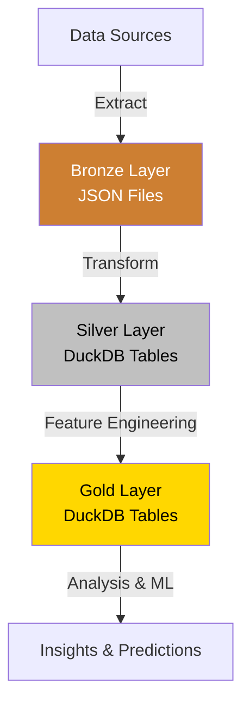
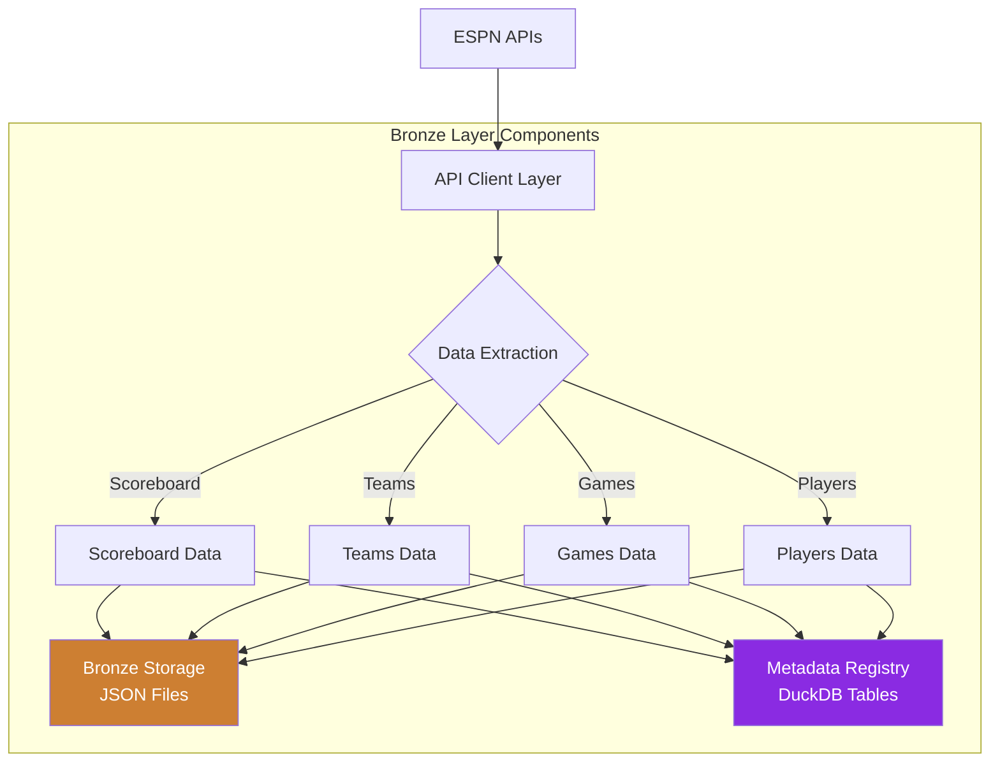
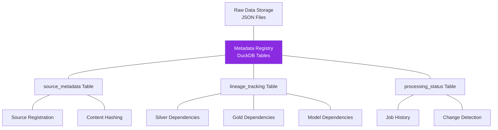
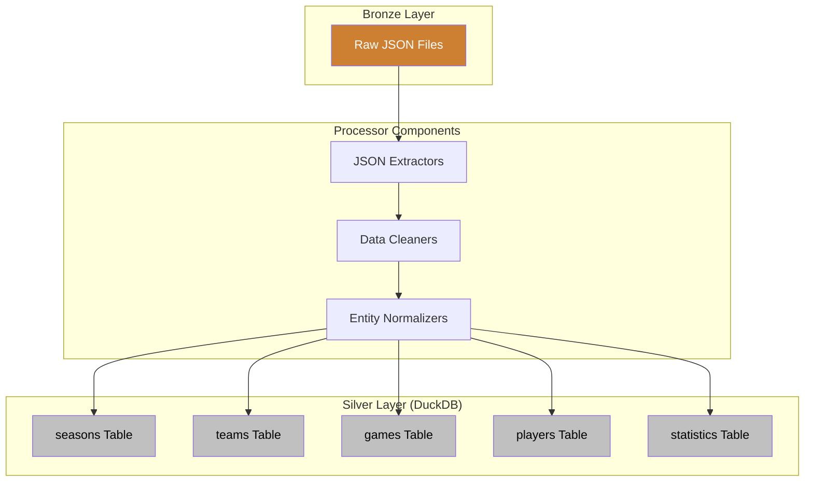
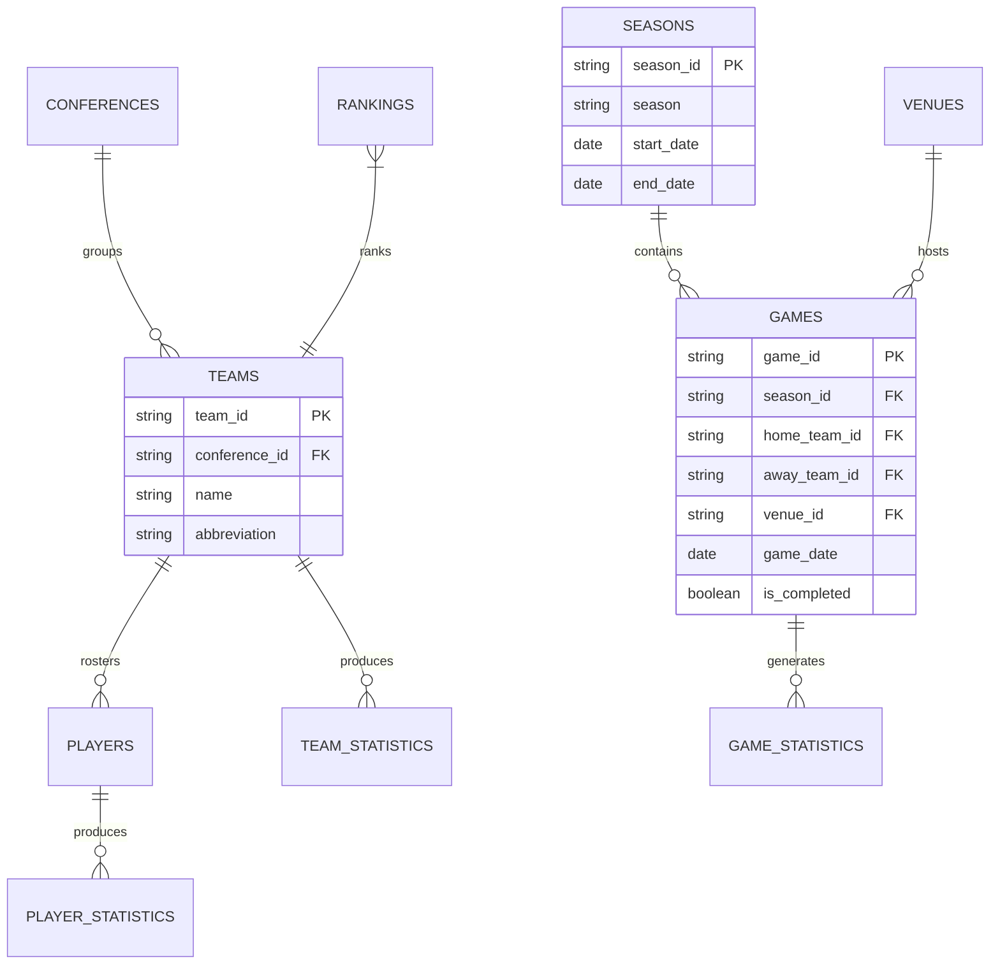
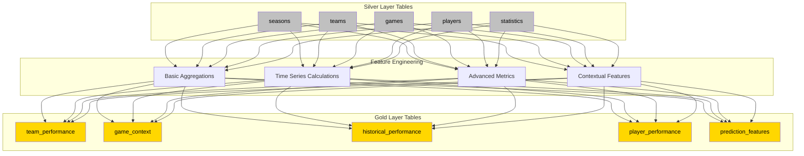
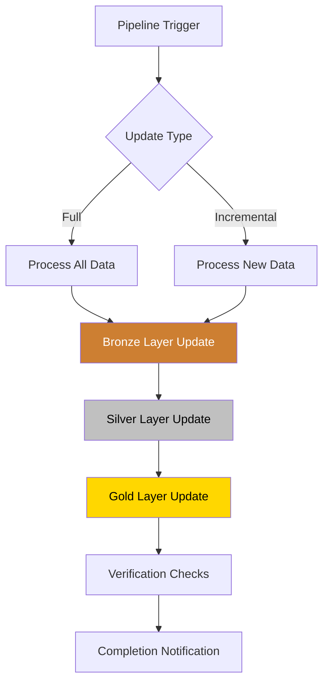

# Data Pipeline

[TOC]

## Overview

The data pipeline follows a medallion architecture with three main layers and integrated DuckDB for structured data storage:



1. **Bronze Layer**: Ingestion of raw data from ESPN APIs, stored in its original JSON form with metadata
2. **Silver Layer**: Transformation of raw data into structured, normalized entity tables in DuckDB
3. **Gold Layer**: Creation of feature-engineered tables in DuckDB ready for analysis and ML

!!! info "Pipeline Design Principles"
    The pipeline is designed with these core principles:
    - **Data Preservation**: Raw data is always preserved in its original form
    - **Unified Storage**: Silver and Gold layer data stored in a single DuckDB database
    - **Incremental Processing**: Support for both full and incremental updates
    - **Reproducibility**: All transformations are documented and repeatable
    - **Error Handling**: Robust error handling at each stage of the pipeline

## 1. Bronze Layer (Raw Data Ingestion)

### Endpoints and Scheduling

The pipeline ingests data from multiple ESPN API endpoints:

| Endpoint        | Update Frequency | Partition Strategy    | Initial Priority |
| --------------- | ---------------- | --------------------- | ---------------- |
| Scoreboard      | Daily            | By date (YYYYMMDD)    | HIGH (MVP)       |
| Teams           | Weekly           | By season             | MEDIUM           |
| Players         | Weekly           | By season             | MEDIUM           |
| Team Statistics | Weekly           | By team, season       | MEDIUM           |
| Team Schedule   | Monthly          | By team, season       | LOW              |
| Game Summary    | Daily            | By game_id            | HIGH             |
| Rankings        | Weekly           | By poll, date         | LOW              |
| Standings       | Weekly           | By conference, season | LOW              |

### Bronze Layer Implementation



#### API Client Layer

- Handles authentication (if needed)
- Implements rate limiting (1-2 seconds between requests)
- Provides retry logic for failed requests
- Logs all API interactions

#### Data Extraction Layer

- Fetches data from ESPN endpoints
- Validates response structure
- Handles pagination for endpoints that return partial data

#### Raw Storage Layer

- Stores raw data as JSON in its original form
- Uses a partitioning scheme based on endpoint and date/season
- Preserves all fields from the original JSON response
- Implements incremental loading to avoid duplicate data

```python
# Example structure for the Scoreboard ingestion module

class ScoreboardIngestion:
    def __init__(self, config):
        self.api_url = config['endpoints']['scoreboard']['url']
        self.params = config['endpoints']['scoreboard']['params']
        self.output_dir = config['storage']['raw_dir']

    def fetch_data(self, date):
        # Fetch data from ESPN API for the given date
        # Implement rate limiting and retries

    def store_raw_data(self, date, data):
        # Store raw data in JSON format
        # Use partitioning by date
        # Register metadata in DuckDB

    def run_pipeline(self, date):
        # Orchestrate the ingestion process
        data = self.fetch_data(date)
        self.store_raw_data(date, data)
```

!!! warning "Rate Limiting" ESPN APIs don't have official rate limits documented. The implementation uses conservative
rate limiting (1-2 seconds between requests) to avoid being blocked.

## 2. Metadata Management System

The pipeline implements a comprehensive metadata management system as DuckDB tables that track data lineage, processing status, and dependencies across all layers of the medallion architecture.



### Metadata Registry Structure

The metadata registry is organized as a set of related tables in the DuckDB database:

```
ncaa.duckdb:
├── source_metadata          # Raw data source metadata
│   ├── source_id            # Composite primary key (endpoint/partition)
│   ├── source_type          # Type of source (scoreboard, teams, etc.)
│   ├── content_hash         # Hash of raw content
│   ├── ingestion_timestamp  # When data was ingested
│   └── ... other metadata columns
│
├── lineage_tracking         # Data lineage across layers
│   ├── entity_id            # Entity identifier
│   ├── entity_type          # Type of entity (silver_table, gold_feature, etc.)
│   ├── source_ids           # Array of source IDs this entity depends on
│   └── ... other lineage columns
│
├── processing_jobs          # Job execution history
│   ├── job_id               # Unique job identifier
│   ├── job_type             # Type of job (ingest, transform, etc.)
│   ├── status               # Job status (success, failed, etc.)
│   └── ... other job columns
│
└── change_detection         # Change tracking for incremental processing
    ├── source_id            # Source identifier
    ├── detection_time       # When change was detected
    ├── needs_processing     # Whether source needs reprocessing
    └── ... other change detection columns
```

### Metadata Components

#### 1. Source Metadata Table

Tracks information about each raw data source:

```sql
CREATE TABLE source_metadata (
    source_id VARCHAR PRIMARY KEY,           -- Unique identifier (e.g., "scoreboard/date=20230301")
    source_type VARCHAR,                     -- Type of source (scoreboard, team_roster, etc.)
    content_hash VARCHAR,                    -- Hash of raw content
    ingestion_timestamp TIMESTAMP,           -- When the data was ingested
    size_bytes INTEGER,                      -- Size of the raw data
    api_version VARCHAR,                     -- Version of the API if available
    endpoint VARCHAR,                        -- Full endpoint path
    parameters VARCHAR,                      -- API parameters used (JSON string)
    last_processed TIMESTAMP,                -- When the data was last processed
    processing_status VARCHAR,               -- Current processing status
    error_message VARCHAR,                   -- Error message if processing failed
    last_processed_hash VARCHAR              -- Content hash when last processed
);
```

#### 2. Lineage Tracking Tables

Tracks relationships between entities across layers:

```sql
-- Silver dependencies (Bronze → Silver)
CREATE TABLE silver_dependencies (
    entity_id VARCHAR PRIMARY KEY,           -- Silver entity identifier
    entity_type VARCHAR,                     -- Type of entity (seasons, teams, etc.)
    source_ids VARCHAR[],                    -- Array of source_ids this entity depends on
    last_updated TIMESTAMP,                  -- When dependencies were last updated
    processor_version VARCHAR,               -- Version of the processor
    processing_parameters VARCHAR            -- Parameters used (JSON string)
);

-- Gold dependencies (Silver → Gold)
CREATE TABLE gold_dependencies (
    feature_id VARCHAR PRIMARY KEY,          -- Feature identifier
    feature_type VARCHAR,                    -- Type of feature
    entity_ids VARCHAR[],                    -- Array of entity_ids this feature depends on
    last_updated TIMESTAMP,                  -- When dependencies were last updated
    generator_version VARCHAR,               -- Version of feature generator
    generation_parameters VARCHAR            -- Parameters used (JSON string)
);

-- Model dependencies (Gold → Model)
CREATE TABLE model_dependencies (
    model_id VARCHAR PRIMARY KEY,            -- Model identifier
    model_type VARCHAR,                      -- Type of model
    feature_ids VARCHAR[],                   -- Array of feature_ids the model depends on
    training_timestamp TIMESTAMP,            -- When the model was trained
    model_version VARCHAR,                   -- Version of the model
    training_parameters VARCHAR              -- Parameters used (JSON string)
);
```

#### 3. Processing Status Tables

Tracks job execution and change detection:

```sql
-- Job history
CREATE TABLE job_history (
    job_id VARCHAR PRIMARY KEY,              -- Unique job identifier
    job_type VARCHAR,                        -- Type of job
    source_type VARCHAR,                     -- Type of source processed
    start_time TIMESTAMP,                    -- When job started
    end_time TIMESTAMP,                      -- When job completed
    status VARCHAR,                          -- Status (success, failed, etc.)
    source_ids VARCHAR[],                    -- Array of source_ids processed
    error_message VARCHAR                    -- Error message if job failed
);

-- Change detection
CREATE TABLE change_detection (
    source_id VARCHAR,                       -- Source identifier
    detection_time TIMESTAMP,                -- When change was detected
    old_hash VARCHAR,                        -- Previous content hash
    new_hash VARCHAR,                        -- Current content hash
    needs_processing BOOLEAN,                -- Whether processing is needed
    affected_entities VARCHAR[],             -- Entities affected by change
    PRIMARY KEY (source_id, detection_time)
);
```

## 3. Silver Layer (Data Processing)

The Silver layer transforms raw JSON data from the Bronze layer into normalized entity tables in DuckDB. This allows for efficient querying, clear relationships through foreign keys, and simplified data access patterns.

### Silver Layer Implementation



### Entity Extraction Process

Data is extracted from raw JSON files into DuckDB tables using a combination of:

1. **JSON Extraction**: Direct SQL queries using DuckDB's JSON functions
2. **Polars Processing**: Python-based transformations using Polars for complex cases
3. **SQL Transformations**: SQL for joins, aggregations, and data reshaping

Example of JSON extraction using DuckDB:

```python
def process_scoreboard_data(db_path, raw_data_path):
    """Process raw scoreboard data into normalized DuckDB tables.

    Args:
        db_path: Path to the DuckDB database
        raw_data_path: Path to the raw data directory
    """
    with duckdb.connect(db_path) as conn:
        # Create games table from scoreboard data
        conn.execute("""
            INSERT INTO games
            SELECT
                json_extract(data, '$.events[*].id') AS game_id,
                CAST(date_str AS DATE) AS game_date,
                json_extract(data, '$.events[*].season.year') AS season_year,
                json_extract(data, '$.events[*].season.type') AS season_type,
                json_extract(data, '$.events[*].competitions[*].venue.id') AS venue_id,
                json_extract(data, '$.events[*].competitions[*].venue.fullName') AS venue_name,
                json_extract(data, '$.events[*].status.type.completed') AS is_completed
            FROM
                read_json_auto(
                    'data/raw/scoreboard/date=*/data.json',
                    format='auto',
                    filename=true
                )
            WHERE NOT EXISTS (
                SELECT 1 FROM games WHERE games.game_id = json_extract(data, '$.events[*].id')
            )
        """)

        # Register lineage in metadata registry
        # (Implementation omitted for brevity)
```

### Silver Layer Entities

The Silver layer organizes data into normalized entity tables with enforced relationships. Key entities include:

| Table Name | Description | Primary Data Source |
|------------|-------------|---------------------|
| seasons    | NCAA basketball seasons with dates | Scoreboard |
| teams      | Team information and metadata | Teams API |
| games      | Game events, results, and context | Scoreboard, Game Summary |
| players    | Player roster information | Team Rosters |
| statistics | Game and season statistics | Team/Player Stats |
| venues     | Game locations | Scoreboard |
| conferences| Conference information | Teams, Standings |
| rankings   | Team rankings by poll | Rankings |

### Entity Relationships

The Silver layer implements a normalized schema with foreign key relationships:



## 4. Gold Layer (Feature Engineering)

The Gold layer transforms normalized Silver layer tables into feature-rich datasets optimized for analysis and machine learning. These features are stored as tables and views in the DuckDB database for efficient querying and extraction.

### Gold Layer Implementation



### Feature Generation Process

Features are generated using SQL queries and views in DuckDB, combined with Polars for complex calculations:

```python
def generate_team_performance_features(db_path):
    """Generate team performance features from silver layer data.

    Args:
        db_path: Path to the DuckDB database
    """
    with duckdb.connect(db_path) as conn:
        # Create rolling average features
        conn.execute("""
            CREATE OR REPLACE TABLE team_performance AS
            WITH game_stats AS (
                SELECT
                    g.game_id,
                    g.game_date,
                    g.season_id,
                    g.home_team_id AS team_id,
                    ts.points,
                    ts.field_goals_made,
                    ts.field_goals_attempted,
                    ts.three_pointers_made,
                    ts.three_pointers_attempted,
                    ts.rebounds,
                    CASE WHEN ts.points > opp.points THEN 1 ELSE 0 END AS win
                FROM
                    games g
                JOIN
                    team_statistics ts ON g.game_id = ts.game_id AND g.home_team_id = ts.team_id
                JOIN
                    team_statistics opp ON g.game_id = opp.game_id AND g.away_team_id = opp.team_id
                WHERE
                    g.is_completed = TRUE

                UNION ALL

                SELECT
                    g.game_id,
                    g.game_date,
                    g.season_id,
                    g.away_team_id AS team_id,
                    ts.points,
                    ts.field_goals_made,
                    ts.field_goals_attempted,
                    ts.three_pointers_made,
                    ts.three_pointers_attempted,
                    ts.rebounds,
                    CASE WHEN ts.points > opp.points THEN 1 ELSE 0 END AS win
                FROM
                    games g
                JOIN
                    team_statistics ts ON g.game_id = ts.game_id AND g.away_team_id = ts.team_id
                JOIN
                    team_statistics opp ON g.game_id = opp.game_id AND g.home_team_id = opp.team_id
                WHERE
                    g.is_completed = TRUE
            )
            SELECT
                team_id,
                game_id,
                game_date,
                season_id,
                points,
                field_goals_made,
                field_goals_attempted,
                CASE WHEN field_goals_attempted > 0
                    THEN field_goals_made / field_goals_attempted
                    ELSE NULL
                END AS field_goal_percentage,
                three_pointers_made,
                three_pointers_attempted,
                CASE WHEN three_pointers_attempted > 0
                    THEN three_pointers_made / three_pointers_attempted
                    ELSE NULL
                END AS three_point_percentage,
                rebounds,
                win,
                AVG(points) OVER (
                    PARTITION BY team_id, season_id
                    ORDER BY game_date
                    ROWS BETWEEN 5 PRECEDING AND CURRENT ROW
                ) AS rolling_avg_points_5_games,
                AVG(points) OVER (
                    PARTITION BY team_id, season_id
                    ORDER BY game_date
                    ROWS BETWEEN 10 PRECEDING AND CURRENT ROW
                ) AS rolling_avg_points_10_games,
                SUM(win) OVER (
                    PARTITION BY team_id, season_id
                    ORDER BY game_date
                    ROWS BETWEEN 5 PRECEDING AND CURRENT ROW
                ) AS wins_last_5_games,
                COUNT(*) OVER (
                    PARTITION BY team_id, season_id
                    ORDER BY game_date
                    ROWS BETWEEN UNBOUNDED PRECEDING AND CURRENT ROW
                ) AS games_played_season,
                SUM(win) OVER (
                    PARTITION BY team_id, season_id
                    ORDER BY game_date
                    ROWS BETWEEN UNBOUNDED PRECEDING AND CURRENT ROW
                ) AS wins_season
            FROM game_stats
            ORDER BY team_id, game_date
        """)

        # Register lineage in metadata registry
        conn.execute("""
            INSERT INTO gold_dependencies (
                feature_id,
                feature_type,
                entity_ids,
                last_updated,
                generator_version,
                generation_parameters
            )
            VALUES (
                'team_performance',
                'team_metrics',
                ['games', 'team_statistics'],
                CURRENT_TIMESTAMP,
                '0.1.0',
                '{"rolling_windows": [5, 10]}'
            )
            ON CONFLICT (feature_id) DO UPDATE SET
                entity_ids = EXCLUDED.entity_ids,
                last_updated = EXCLUDED.last_updated,
                generator_version = EXCLUDED.generator_version,
                generation_parameters = EXCLUDED.generation_parameters
        """)
```

### Gold Layer Feature Sets

The Gold layer organizes features into purpose-specific tables and views:

| Feature Table | Description | Primary Data Source | Update Frequency |
|---------------|-------------|---------------------|------------------|
| team_performance | Team level statistics, trends, and metrics | teams, games, statistics | After each game day |
| player_performance | Player level statistics and metrics | players, statistics | After each game day |
| game_context | Game situation features (home/away, rest days, etc.) | games, teams | After schedule updates |
| historical_performance | Historical matchups and outcomes | games, statistics | Weekly |
| prediction_features | Combined feature sets ready for model consumption | All feature tables | Before predictions |

## Pipeline Orchestration

The entire pipeline is orchestrated to handle both full and incremental updates:



### Orchestration Components

1. **Configuration Management**:

   - YAML configuration files for each pipeline component
   - Environment-specific settings
   - Feature definitions

1. **Scheduling**:

   - Daily updates for time-sensitive data (scoreboard, games)
   - Weekly updates for less volatile data (teams, players)
   - On-demand updates for historical data

1. **Monitoring and Logging**:

   - Comprehensive logging at each stage
   - Error notifications
   - Data quality monitoring

1. **Error Recovery**:

   - Automatic retries for transient failures
   - Manual intervention points for persistent failures
   - State preservation for resuming failed runs

## Related Documentation

- [Data Entity Model](data-entities.md): Detailed entity structure and relationships
- [Feature Engineering](feature-engineering.md): In-depth feature creation methodology
- [Project Architecture](index.md): Overall architectural overview
