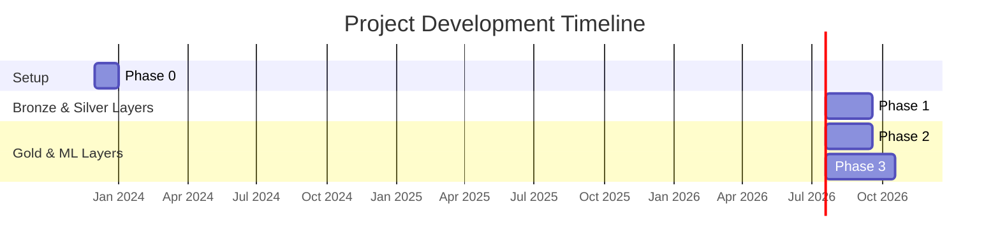
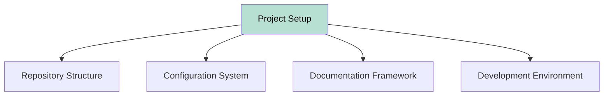
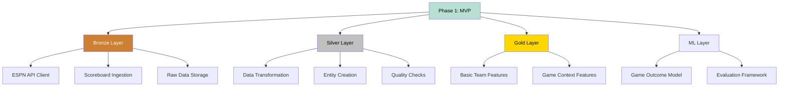
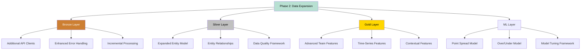
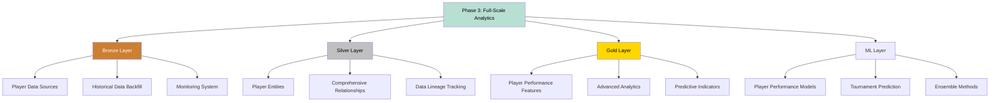
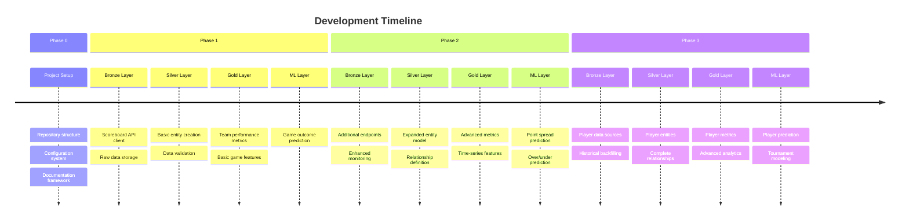

# Project Development Phases

[TOC]

This document outlines the phased approach to developing the NCAA Basketball Analytics Project. Each phase builds on the
previous one, adding new data sources, features, and modeling capabilities across the Bronze, Silver, and Gold layers of
the medallion architecture.

## Phase 0: Project Setup and Infrastructure

**Goal**: Establish the basic project structure and infrastructure.

### Tasks:

1. Set up project repository and directory structure
1. Create configuration files
1. Implement basic logging and error handling
1. Set up development environment
1. Create documentation structure

### Deliverables:

- Project repository with defined structure
- Basic configuration system
- Initial documentation

## Phase 1: MVP - Basic Data Pipeline and Game Prediction

**Goal**: Implement a minimal viable product focused on fetching, processing, and analyzing scoreboard data across all
medallion layers.

### Tasks:

#### Bronze Layer (Data Ingestion)

1. Implement ESPN API client for the scoreboard endpoint
1. Create data ingestion pipeline for scoreboard data
1. Store raw data in Parquet format with appropriate partitioning
1. Implement basic error handling and logging

#### Silver Layer (Data Processing)

1. Transform raw scoreboard data into structured format using Polars
1. Create and populate basic entity tables (seasons, phases, games)
1. Implement data validation and quality checks

#### Gold Layer (Feature Engineering)

1. Generate basic team performance metrics
   - Win/loss records
   - Points scored/allowed
   - Winning streaks
   - Home/away performance
1. Create game-level features
   - Team strength comparison
   - Home/away indicator
   - Conference matchup indicator

#### ML Layer (Modeling)

1. Implement simple game outcome prediction model
   - Binary classification: win/loss for a team
   - Use Random Forest as initial algorithm
   - Evaluate with cross-validation
1. Create prediction evaluation framework
   - Accuracy, precision, recall metrics
   - Confusion matrix visualization
   - Feature importance analysis

### Deliverables:

- Functional Bronze layer pipeline for scoreboard data
- Silver layer entities for seasons, phases, and games
- Gold layer with basic feature engineering
- Initial game outcome prediction model
- Performance evaluation framework

## Phase 2: Data Expansion and Enhanced Features

**Goal**: Expand the data pipeline to include more endpoints and develop more sophisticated features across the
medallion layers.

### Tasks:

#### Bronze Layer Expansion

1. Implement ESPN API clients for:
   - Teams endpoint
   - Game Summary endpoint
   - Rankings endpoint
   - Team Statistics endpoint
1. Extend the ingestion pipeline for new endpoints
1. Enhance error handling and monitoring

#### Silver Layer Enhancement

1. Normalize team and game information
1. Create additional entities for rankings and statistics
1. Implement relationships between entities
1. Create views for common query patterns

#### Gold Layer Advancement

1. Generate advanced team performance metrics:
   - Offensive/defensive efficiency
   - Strength of schedule
   - Performance against different opponent types
1. Develop time-series features:
   - Rolling averages with different windows
   - Momentum indicators
   - Trend analysis
1. Create contextual features:
   - Rest days
   - Travel distance
   - Ranking differentials

#### ML Layer Expansion

1. Enhance game outcome prediction model
   - Try multiple algorithms
   - Implement hyperparameter tuning
   - Feature selection
1. Develop point spread prediction model
   - Regression model for margin of victory
   - Evaluate with MAE and RMSE
1. Create over/under prediction model
   - Regression model for total points
   - Evaluate performance against betting lines

### Deliverables:

- Expanded Bronze layer with multiple endpoints
- Enhanced Silver layer with additional entities
- Advanced Gold layer feature engineering pipeline
- Multiple prediction models with improved accuracy

## Phase 3: Player Data Integration and Full-Scale Analytics

**Goal**: Incorporate player-level data and develop comprehensive basketball analytics across all medallion layers.

### Tasks:

#### Bronze Layer Completion

1. Implement ESPN API clients for:
   - Player endpoints
   - Team Roster endpoint
   - Player Game Stats (from Game Summary)
1. Set up monitoring and alerting for API changes
1. Implement historical data backfill capabilities

#### Silver Layer Integration

1. Extend the data model to include player information
1. Link player performance to team performance
1. Create comprehensive entity relationships
1. Implement data lineage tracking

#### Gold Layer Advancement

1. Develop player performance metrics
   - Player efficiency rating
   - Value over replacement
   - Impact metrics
1. Create advanced analytics features
   - Matchup-specific indicators
   - Performance in different contexts
   - Advanced statistical measures
1. Generate predictive indicators
   - Win probability models
   - Player performance projections
   - Tournament success indicators

#### ML Layer Expansion

1. Develop player performance prediction models
   - Predict key statistics
   - Identify player matchup advantages
1. Create tournament success prediction model
   - Predict advancement probability
   - Simulate tournament outcomes
1. Implement ensemble methods
   - Combine multiple models
   - Weighted averaging based on historical accuracy

### Deliverables:

- Complete Bronze layer with all relevant endpoints
- Comprehensive Silver layer entity model
- Advanced Gold layer with player and team features
- Suite of prediction models for various tasks
- Interactive prediction and analysis tools

## Implementation Timeline and Priorities

The development will follow a systematic approach with clear priorities:

### Priority Matrix

!!! tip "Implementation Priority" The implementation will follow this priority order across phases: 1. Core
infrastructure and pipelines 2. Team and game data 3. Advanced metrics and features 4. Player-specific components 5.
Tournament and special event analysis

## Integration Points

The project will integrate across all medallion layers:

1. **Data Integration**

   - Bronze layer preserves raw data from all sources
   - Silver layer maintains entity relationships
   - Gold layer combines features across entities

1. **Feature Integration**

   - Team and player features are combined for game prediction
   - Historical and contextual features are integrated
   - Feature sets are versioned for reproducibility

1. **Model Integration**

   - Models build on features from all categories
   - Ensemble methods combine multiple models
   - Predictions feed back into feature engineering

## Related Documentation

- [Project Architecture](index.md): Overall architectural overview
- [Data Pipeline](data-pipeline.md): Details of the data ingestion and processing pipeline
- [Data Entity Model](data-entities.md): Structure of the Silver layer entities
- [Feature Engineering](feature-engineering.md): Gold layer feature creation approach
- [Model Development](model-development.md): ML layer methodology
