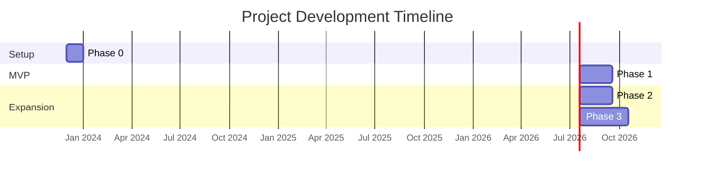

# Development Phases

[TOC]

This document outlines the phased approach for developing the NCAA Basketball Prediction Model, prioritizing a functional MVP before expanding capabilities.

## Phase 0: Project Setup (1 month)

**Goal**: Establish project foundation and environment.

**Key Deliverables**:
- Repository structure and configuration
- Development environment setup
- Documentation framework
- Initial test infrastructure

## Phase 1: MVP - Basic Prediction Pipeline (2 months)

**Goal**: Implement a functioning end-to-end prediction pipeline focusing on game outcomes.

### Focus Areas:

#### Bronze Layer
- ESPN API client for scoreboard and team data
- Basic data ingestion framework
- Simple storage of raw JSON data

#### Silver Layer
- Data transformation for games and teams
- Entity creation for core data structures
- Basic data validation

#### Gold Layer
- Team performance metrics (win/loss records, scoring)
- Game context features (home/away, matchup history)
- Basic statistical indicators

#### ML Layer
- Simple win/loss prediction model
- Model evaluation framework
- Initial prediction generation

**Success Criteria**: End-to-end pipeline that can predict game outcomes with >55% accuracy.

## Phase 2: Enhanced Features and Models (2 months)

**Goal**: Expand data sources and improve prediction accuracy.

### Enhancements:

#### Data Sources
- Additional ESPN API endpoints
- Historical data expansion
- Team and player statistics

#### Features
- Advanced team metrics
- Time-series features (momentum, trends)
- Opponent-specific performance indicators

#### Models
- Improved algorithms and hyperparameter tuning
- Point spread and over/under predictions
- Model comparison framework

**Success Criteria**: Prediction accuracy >65% with expanded prediction types.

## Phase 3: Advanced Analytics (3 months)

**Goal**: Incorporate advanced analytics and expand prediction capabilities.

### Advanced Features:

#### Data Integration
- Player-level statistics
- Advanced contextual factors
- External data sources (optional)

#### Analytics
- Advanced statistical models
- Deep learning approaches
- Ensemble methods

#### Outputs
- Detailed prediction explanations
- Confidence metrics
- Interactive results (future consideration)

**Success Criteria**: Comprehensive prediction system with multiple model types and >70% accuracy.

## Implementation Priorities

Each phase follows this implementation sequence:

1. **Data First**: Ensure data pipeline is solid before proceeding
2. **Testing Always**: Maintain test coverage throughout development
3. **Simple Before Complex**: Start with simpler models before sophistication
4. **Working Software**: Prioritize working end-to-end solutions over perfect components

## MVP Definition

For clarity, our MVP is defined as:

- Data ingestion from ESPN APIs for current season games
- Basic team statistics processing
- Simple feature engineering focused on win/loss patterns
- Initial prediction model for game outcomes
- Command-line interface for running predictions
