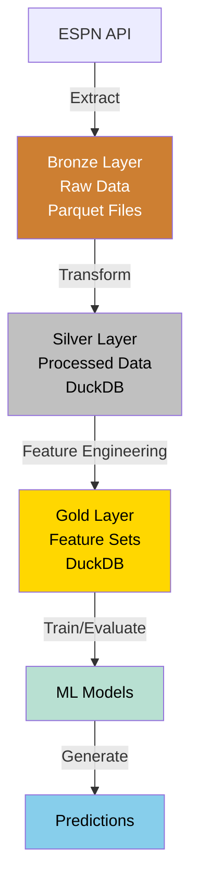
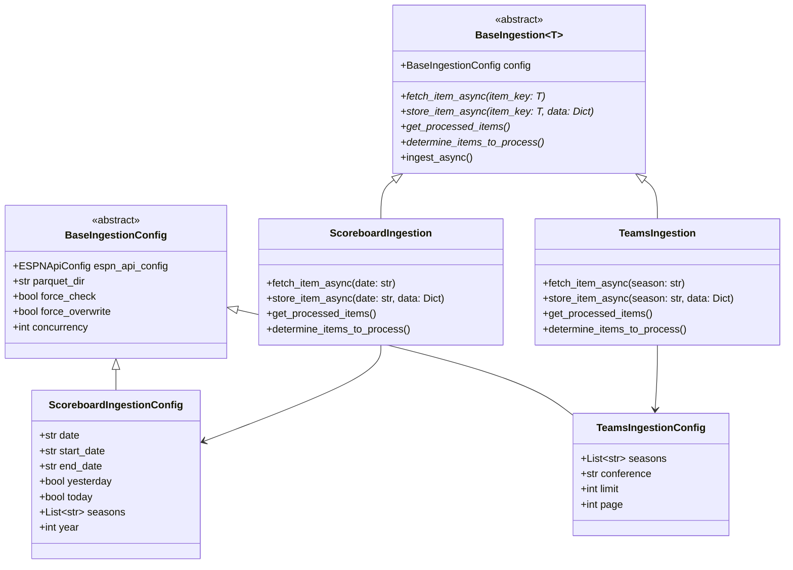

# NCAA Basketball Prediction Model Architecture

[TOC]

## System Overview

The NCAA Basketball Prediction Model follows a medallion architecture designed for data processing, feature engineering, and machine learning:

- **Bronze Layer**: Raw data preserved in partitioned Parquet files
- **Silver Layer**: Cleaned, transformed data in normalized structure in DuckDB
- **Gold Layer**: Feature-engineered datasets ready for modeling in DuckDB
- **ML Layer**: Models, predictions, and evaluation metrics



## MVP Focus Areas

For the initial version, we're focusing on:

1. **Core ESPN Data Sources**:
   - Scoreboard data (games, scores, teams)
   - Team statistics
   - Basic player information

2. **Essential Features**:
   - Team performance metrics (win/loss records, scoring efficiency)
   - Game context (home/away, conference matchups)
   - Historical performance indicators

3. **Initial Prediction Models**:
   - Game outcome prediction (win/loss)
   - Basic evaluation framework

## Data Flow

The data flows through these processing stages:

1. **ESPN API → Bronze**: Raw data preserved in partitioned Parquet files
2. **Bronze → Silver**: Data cleaning, validation, and normalization in DuckDB
3. **Silver → Gold**: Feature engineering and preparation for modeling in DuckDB
4. **Gold → Models**: Training, evaluation, and prediction generation

## Implementation Technologies

- **Storage**:
  - Bronze layer: Partitioned Parquet files with year-month partitioning
  - Silver and Gold layers: DuckDB for normalized and feature tables
- **Processing**: Python, Polars, SQL
- **Modeling**: Scikit-learn, PyTorch (later phases)

## Project Structure

```
ncaa-prediction-model/
├── config/              # Configuration files
├── data/
│   ├── raw/             # Bronze layer - partitioned Parquet files
│   │   ├── scoreboard/  # Organized by API endpoint
│   │   │   ├── year=YYYY/ # Year partitions
│   │   │   │   └── month=MM/ # Month partitions
│   │   ├── teams/       # Teams endpoint data
│   │   └── ...          # Other endpoints
│   ├── ncaa.duckdb      # Database containing silver and gold layers
│   ├── predictions/     # Output predictions
│   └── models/          # Trained models
├── src/                 # Source code
│   ├── ingest/          # Data ingestion (Bronze)
│   │   ├── __init__.py  # Exports for ingestion functions and config classes
│   │   ├── base.py      # Abstract base classes for ingestion
│   │   ├── scoreboard.py # Scoreboard-specific implementation
│   │   ├── teams.py     # Teams-specific implementation
│   │   └── ingest_all.py # Unified ingestion for multiple endpoints
│   ├── process/         # Data processing (Silver)
│   ├── features/        # Feature engineering (Gold)
│   ├── models/          # ML models
│   └── utils/           # Utilities
│       ├── config.py    # Configuration management
│       └── api.py       # API client utilities
├── run.py               # Command-line interface
└── tests/               # Test suite
    ├── ingest/          # Tests for ingestion modules
    └── ...              # Other test modules
```

## Ingestion Architecture

The data ingestion system uses an abstract, extensible architecture:



### Key Benefits

1. **Abstraction**: Common ingestion logic is abstracted for reuse
2. **Flexibility**: Each endpoint can have custom configuration and implementation
3. **Extensibility**: Adding new endpoints follows a standard pattern
4. **Testability**: Abstract design enables easy mocking and testing
5. **Concurrency**: Asynchronous design for efficient API usage

## Configuration Management

The project uses a hierarchical configuration system:

1. **Base Configurations**: Abstract classes define common parameters
2. **Endpoint-Specific Configurations**: Extend base classes with endpoint-specific parameters
3. **Configuration Sources**: Values cascade from defaults to environment-specific settings
4. **Command-Line Overrides**: CLI arguments can override configuration values

See [Configuration Management](configuration-management.md) for more details.

## Key Interfaces

1. **Data Ingestion**:
   - `BaseIngestion`: Abstract base class for all ingestion operations
   - `ingest_scoreboard()`, `ingest_teams()`: Endpoint-specific functions
   - `ingest_all()`: Unified ingestion for multiple endpoints

2. **Data Processing**: Transform functions for each entity type
3. **Feature Engineering**: Feature generation for model consumption
4. **Model Interface**: Training, evaluation, and prediction functions

## Command-Line Interface

The CLI provides a consistent interface for all operations:

```
python run.py ingest [endpoint] [options]
python run.py process bronze-to-silver --entity ENTITY [options]
python run.py features generate --feature-set FEATURE_SET [options]
python run.py model train --model-type MODEL_TYPE [options]
```

See [CLI Design](cli-design.md) for complete command reference.

## Development Phases

See [Development Phases](development-phases.md) for the project roadmap, which follows this progression:

1. **MVP**: Basic pipeline and initial prediction capability
2. **Phase 2**: Additional data sources and enhanced features
3. **Phase 3**: Advanced analytics and expanded model types

## Performance Benefits

The architecture provides significant performance advantages:

1. **Storage Efficiency**: Year-month partitioned Parquet reduces bronze layer storage
2. **Optimized Reads**: Partition pruning improves query performance for time-based queries
3. **Flexible Processing**: Decoupled storage enables parallel processing and better workload management
4. **Concurrent Ingestion**: Asynchronous operations for efficient API usage

## Extending the System

To add a new ESPN API endpoint:

1. Create a new module in `src/ingest/` (e.g., `players.py`)
2. Define an endpoint-specific configuration class extending `BaseIngestionConfig`
3. Implement an ingestion class extending `BaseIngestion`
4. Update `src/ingest/__init__.py` to export the new classes
5. Add the endpoint to `valid_endpoints` in `ingest_all.py`
6. Update the CLI in `run.py` to add the new endpoint command

## Related Documentation

- [Data Pipeline](data-pipeline.md): Data ingestion and processing details
- [Data Entities](data-entities.md): Entity structure and relationships
- [Data Directory Structure](data-directory-structure.md): Organization of data files
- [Configuration Management](configuration-management.md): Configuration approach
- [CLI Design](cli-design.md): Command-line interface design
- [Logging Strategy](logging-strategy.md): Logging approach
- [Development Phases](development-phases.md): Project roadmap
