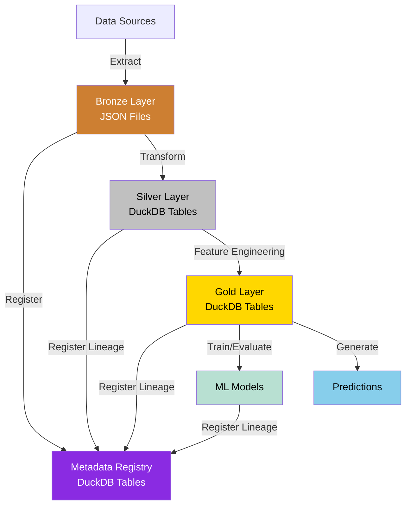
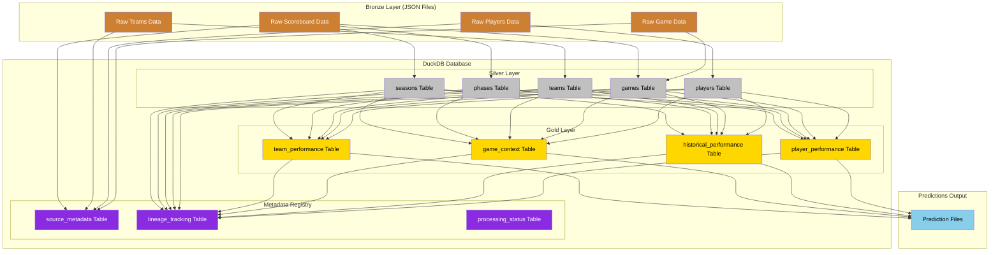

# Project Architecture

[TOC]

## System Architecture Overview

The NCAA Basketball Analytics Project follows a medallion architecture designed for scalability, maintainability, and
expandability. The architecture consists of three primary data layers plus auxiliary components:

!!! info "Medallion Architecture with DuckDB Integration"
    - **Bronze Layer**: Raw data preserved in its original form as JSON files
    - **Silver Layer**: Cleaned, transformed data in normalized entity tables in DuckDB
    - **Gold Layer**: Feature-engineered datasets in DuckDB ready for analysis and modeling
    - **Metadata Registry**: Data lineage and metadata tracked in DuckDB tables

## Key Components

### 1. Data Sources

- ESPN undocumented APIs for NCAA men's basketball data
- Primary endpoints: Scoreboard, Teams, Players, Game Summaries, etc.
- Accessed using HTTP requests with appropriate rate limiting

### 2. Bronze Layer (Data Ingestion)

- Fetches data from ESPN APIs with error handling and retry mechanisms
- Preserves raw data in its original JSON format with appropriate partitioning
- Implements incremental loading to avoid fetching the same data twice
- Logs all API interactions for debugging and auditing

### 3. Metadata Registry

- Implemented as DuckDB tables for efficient querying and integration
- Tracks data lineage across all layers of the medallion architecture
- Maintains source metadata, processing status, and change detection
- Enables impact analysis of data changes across the pipeline
- Provides efficient queries for tracking dependencies between entities, features, and models

### 4. Silver Layer (Data Processing)

- Transforms raw JSON data into normalized DuckDB tables using SQL and Polars
- Creates a normalized database schema with clear relationships and foreign keys
- Implements data cleaning, normalization, and quality checks
- Creates a unified data model that connects different endpoints
- See [Data Entity Model](data-entities.md) for details on the entity structure

### 5. Gold Layer (Feature Engineering)

- Implemented as DuckDB tables and views for efficient analytical processing
- Generates team, player, and game-level features using SQL and Polars
- Computes statistical measures, trends, and derived metrics
- Implements time-series features to capture momentum and patterns
- Creates feature sets optimized for different prediction tasks
- See [Feature Engineering](feature-engineering.md) for details on feature creation

### 6. Machine Learning Layer

- Develops prediction models for game outcomes, player performance, etc.
- Supports model experimentation, training, and evaluation
- Implements model versioning and results tracking
- Provides an interface for making predictions with trained models
- See [Model Development](model-development.md) for methodology

### 7. Predictions Output

- Stores prediction outputs for analysis and evaluation
- Enables historical tracking of prediction performance
- Supports various export formats for integration with external systems

## Data Flow

1. **API to Bronze Layer**:

   - Data is fetched from ESPN APIs and stored as JSON in its original form
   - Files are partitioned by endpoint and date
   - All raw JSON structure is preserved
   - Metadata about each source is registered in the DuckDB metadata registry

2. **Bronze to Metadata Registry**:

   - Each raw data source is registered with its metadata in DuckDB tables
   - Content hashes are calculated for change detection
   - Processing status is tracked for each source
   - Data lineage is recorded as data moves through layers

3. **Bronze to Silver Layer**:

   - Raw JSON files are transformed into normalized entity tables in DuckDB
   - Combination of SQL and Polars is used for efficient data transformations
   - Foreign key relationships maintain data integrity in the DuckDB schema
   - Lineage between raw sources and silver entities is recorded in the metadata registry

4. **Silver to Gold Layer**:

   - Processed entity tables are used to generate feature tables in DuckDB
   - Features are organized by purpose with appropriate indexing
   - Feature sets are versioned for reproducibility
   - Lineage between silver entities and gold features is recorded in the metadata registry

5. **Gold to Models**:

   - Features are extracted from DuckDB and used to train ML models
   - Models are evaluated and the best ones are saved
   - Predictions are generated and stored for analysis
   - Lineage between features and models is tracked in the metadata registry

## Technical Choices

### Storage

- **Bronze Layer**: Raw JSON files partitioned by endpoint and date (preserved as-is)
- **Silver Layer**: Normalized tables in a single DuckDB database
- **Gold Layer**: Feature tables and views in the same DuckDB database
- **Metadata Registry**: Tables within the same DuckDB database
- **Predictions**: Output files in a dedicated directory
- **Models**: Pickle files for trained models

### Processing

- **DuckDB**: For efficient analytical processing and storage of structured data
- **Polars**: For data transformation operations outside of SQL
- **SQL**: For querying and transformations within DuckDB
- **Python**: For orchestration and implementation

### Modularity

- Each layer is implemented as separate modules
- Components communicate through well-defined interfaces
- Configuration is externalized in YAML files

## Documentation Index

- [Data Pipeline](data-pipeline.md): Details of the data ingestion and processing pipeline
- [Data Entity Model](data-entities.md): Structure and relationships of the processed data entities
- [Feature Engineering](feature-engineering.md): Approach to generating features for ML models
- [Model Development](model-development.md): Methodology for developing and evaluating ML models
- [Development Phases](development-phases.md): Roadmap and milestones for project development

## Scalability Considerations

!!! tip "Designed for Single-Machine Scale" The current architecture is optimized for single-machine processing but
follows patterns that would allow scaling to distributed systems if needed in the future.

- **Computation**: Designed to run efficiently on a single machine
- **Storage**: Uses DuckDB for efficient storage and fast analytical queries
- **API Access**: Implements rate limiting and caching to respect ESPN's APIs
- **Extensibility**: Easy to add new data sources, features, and models
