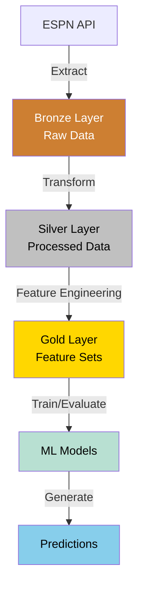

# NCAA Basketball Prediction Model Architecture

[TOC]

## System Overview

The NCAA Basketball Prediction Model follows a medallion architecture designed for data processing, feature engineering, and machine learning:

- **Bronze Layer**: Raw data preserved in its original form
- **Silver Layer**: Cleaned, transformed data in normalized structure
- **Gold Layer**: Feature-engineered datasets ready for modeling
- **ML Layer**: Models, predictions, and evaluation metrics



## MVP Focus Areas

For the initial version, we're focusing on:

1. **Core ESPN Data Sources**:
   - Scoreboard data (games, scores, teams)
   - Team statistics
   - Basic player information

2. **Essential Features**:
   - Team performance metrics (win/loss records, scoring efficiency)
   - Game context (home/away, conference matchups)
   - Historical performance indicators

3. **Initial Prediction Models**:
   - Game outcome prediction (win/loss)
   - Basic evaluation framework

## Data Flow

The data flows through these processing stages:

1. **ESPN API → Bronze**: Raw data preserved as-is
2. **Bronze → Silver**: Data cleaning, validation, and normalization
3. **Silver → Gold**: Feature engineering and preparation for modeling
4. **Gold → Models**: Training, evaluation, and prediction generation

## Implementation Technologies

- **Storage**: DuckDB for all data layers (Bronze, Silver, Gold)
- **Processing**: Python, Polars, SQL
- **Modeling**: Scikit-learn, PyTorch (later phases)

## Project Structure

```
ncaa-prediction-model/
├── config/              # Configuration files
├── data/                # Data directory
│   ├── ncaa.duckdb      # Database containing all data layers
│   ├── predictions/     # Output predictions
│   └── models/          # Trained models
├── src/                 # Source code
│   ├── ingest/          # Data ingestion (Bronze)
│   ├── process/         # Data processing (Silver)
│   ├── features/        # Feature engineering (Gold)
│   ├── models/          # ML models
│   └── utils/           # Utilities
├── run.py               # Command-line interface
└── tests/               # Test suite
```

## Key Interfaces

1. **Data Ingestion**: ESPN API client for data collection
2. **Data Processing**: Transform functions for each entity type
3. **Feature Engineering**: Feature generation for model consumption
4. **Model Interface**: Training, evaluation, and prediction functions

## Development Phases

See [Development Phases](development-phases.md) for the project roadmap, which follows this progression:

1. **MVP**: Basic pipeline and initial prediction capability
2. **Phase 2**: Additional data sources and enhanced features
3. **Phase 3**: Advanced analytics and expanded model types

## Related Documentation

- [Data Pipeline](data-pipeline.md): Data ingestion and processing details
- [Data Entities](data-entities.md): Entity structure and relationships
- [Data Directory Structure](data-directory-structure.md): Organization of data files
- [Configuration Management](configuration-management.md): Configuration approach
- [CLI Design](cli-design.md): Command-line interface design
- [Logging Strategy](logging-strategy.md): Logging approach
- [Development Phases](development-phases.md): Project roadmap
