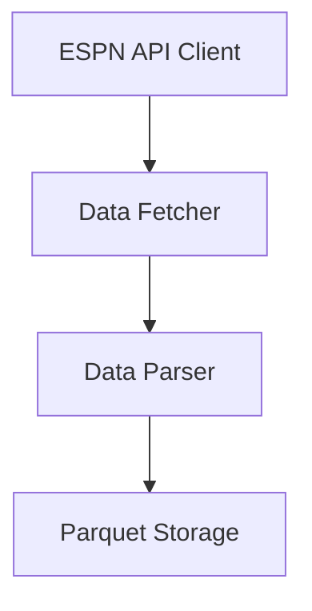

# AI Task Authoring Guide

This guide provides best practices for creating GitHub issues and milestone documentation that set AI coding agents up for success on the NCAA Basketball Prediction Model project.

## Key Principles for AI-Friendly Tasks

1. **Clear Boundaries**: Define explicit scope with clear start and end points
2. **Contextual Information**: Provide relevant background without overwhelming detail
3. **Implementation Guidance**: Include starter code and design patterns to follow
4. **Testable Requirements**: Define concrete, verifiable acceptance criteria
5. **Anticipate Questions**: Address likely points of confusion proactively

## Task Structure for GitHub Issues

A well-structured GitHub issue for an AI agent should include:

### 1. Descriptive Title

Use a concise, action-oriented title that clearly indicates what's being implemented:

✅ "Implement ESPN Game Parser for Collection Pipeline"  
❌ "Parser needed"

### 2. Task Summary

Begin with a one-sentence summary of what needs to be done:

> Develop a parser to transform raw ESPN API game response into our standardized format for storage.

### 3. Context and Background

Explain why this task matters and how it fits into the larger project:

```
The Collection Pipeline requires a parser component that can transform raw ESPN API 
responses (JSON) into a structured format suitable for our Parquet storage. This 
parser will handle the game data endpoint responses, extracting relevant fields and 
normalizing the data structure.
```

### 4. Specific Requirements

Break down the task into discrete, testable requirements. Use checklists for clear tracking:

```
### Functional Requirements

- [ ] Parse basic game metadata (game_id, date, season, status)
- [ ] Extract team information (team_id, name, score)
- [ ] Handle different game statuses (scheduled, in-progress, final)
```

### 5. Implementation Guidance

Provide starter code, pseudo-code, or function signatures:

````
```python
def clean_game_data(game_response: dict) -> dict:
    """
    Parse and transform ESPN API game response into standardized format.
    
    Args:
        game_response: Raw ESPN API response dictionary
        
    Returns:
        Standardized game data dictionary with consistent field names
    """
    # Implementation steps...
    pass
```
````

### 6. Explicit Acceptance Criteria

Define exactly what "done" means:

```
## Acceptance Criteria

- [ ] All tests pass (`uv python -m pytest tests/data/collection/espn/test_parsers.py -v`)
- [ ] Parser correctly handles all test fixtures in `tests/fixtures/espn_responses/`
- [ ] Function handles missing fields gracefully
```

### 7. Resources and References

Provide links to documentation, examples, or similar implementations:

```
## Resources

- [ESPN API Documentation](https://link-to-docs)
- [Sample ESPN response](tests/fixtures/espn_responses/sample_game.json)
```

### 8. Constraints and Caveats

Mention any limitations, performance considerations, or edge cases to be aware of:

```
## Constraints

- Must handle all current ESPN API response formats without breaking changes
- Should be efficient with minimal memory overhead
```

## Milestone Documentation

Milestones should be structured to enable easy breakdown into AI-friendly tasks:

### 1. Clear Component Boundaries

Define the milestone around a coherent component or feature set:

✅ "Data Collection Pipeline"  
❌ "Backend Work"

### 2. Architecture Diagram

Include a visual representation of how components interact:

````

````

### 3. Key Components Section

Identify each major component with its responsibilities and associated files:

```
### ESPN API Client

A low-level client responsible for making HTTP requests to ESPN endpoints, 
managing rate limiting, and handling connection issues.

**Key files:**
- `src/data/collection/espn/client.py`
- `tests/data/collection/espn/test_client.py`
```

### 4. Explicit Task Breakdown

List the specific tasks that will implement the milestone:

```
## Tasks Breakdown

1. **Implement ESPN API Client**
   - Create HTTP client with appropriate rate limiting
   - Implement connection resilience (retries, circuit breakers)
   - Support multiple ESPN endpoints

2. **Develop Game Data Parser**
   - Transform raw game data responses into standardized format
   - Handle different game statuses and response structures
```

### 5. Implementation Approach

Provide guidance on the development strategy:

```
## Implementation Approach

Each task should follow these principles:

1. **Test-First Development**: Create comprehensive tests before implementation
2. **Incremental Complexity**: Start with simple implementations and enhance iteratively
```

### 6. Success Criteria

Define clear milestone completion criteria:

```
## Success Criteria

This milestone will be considered complete when:

1. All tests for collection components pass
2. The collection pipeline can:
   - Fetch complete historical seasons (2002-present)
   - Perform incremental updates during a season
```

## Examples

For reference, see these example documents:

- [AI Task Example](../examples/ai_task_example.md): Sample GitHub issue for an AI agent
- [AI Milestone Example](../examples/ai_milestone_example.md): Sample milestone documentation

## Organization of Tasks and Milestones

Tasks and milestones are organized in a hierarchical structure:

1. **Milestone Documentation**: Located in `docs/development/milestones/`
2. **Task Documentation**: Located in `docs/development/milestones/<milestone-name>/tasks/`

This structure ensures that:
- Tasks are clearly associated with their parent milestone
- Documentation is maintained alongside implementation
- AI agents can easily navigate between related tasks and understand project context

When creating a new task:
1. Copy the task template from `docs/templates/task_template.md`
2. Save it to the appropriate milestone tasks directory
3. Add it to the task index file for that milestone
4. Create a GitHub issue linked to the task documentation

### Creating GitHub Issues from Task Descriptions

When creating GitHub issues from task descriptions, AI agents should use the following approach to avoid newline character limitations in terminal commands:

1. First, create a markdown file with the task content:
   ```bash
   # Create a markdown file for the issue
   cat > issue.md << 'EOF'
   # Task content goes here
   EOF
   ```

2. Then, use the `-F` flag with `gh issue create` to use the file content:
   ```bash
   # Create GitHub issue from file content
   gh issue create -t "Task Title" -F issue.md
   ```

This approach ensures that multiline content and formatting are preserved correctly when creating GitHub issues through terminal commands.

## Best Practices

1. **Start Small**: Begin with well-defined, contained tasks to help the AI agent learn the codebase
2. **Explicit over Implicit**: Don't assume the AI understands implicit requirements or conventions
3. **Include Tests**: Whenever possible, provide test cases or at least test requirements
4. **Anticipate Questions**: Include an FAQ or "Questions for Clarification" section
5. **Reference Existing Code**: Point to similar implementations when available
6. **Document Prerequisites**: List any setup or configuration needed before starting

## Common Pitfalls to Avoid

1. **Ambiguous Requirements**: Vague tasks lead to incorrect implementations
2. **Missing Context**: AI agents need sufficient background to understand the purpose
3. **Overwhelming Information**: Too much detail can obscure the core requirements
4. **Assuming Knowledge**: Don't assume familiarity with project-specific terms or patterns
5. **No Clear Success Criteria**: AI agents need explicit definitions of "done" 