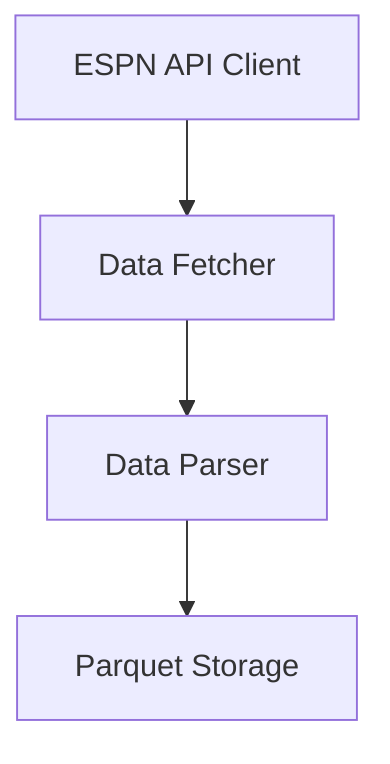

# AI Task Authoring Guide

This guide provides best practices for creating GitHub issues and milestone documentation that set AI coding agents up for success on the NCAA Basketball Prediction Model project.

## Key Principles for AI-Friendly Tasks

1. **Clear Boundaries**: Define explicit scope with clear start and end points
2. **Contextual Information**: Provide relevant background without overwhelming detail
3. **Implementation Guidance**: Include starter code and design patterns to follow
4. **Testable Requirements**: Define concrete, verifiable acceptance criteria
5. **Anticipate Questions**: Address likely points of confusion proactively

## GitHub Milestone Management

When organizing work into milestones, use these approaches to create and manage milestones in GitHub and associate issues with them.

### Creating a Milestone

Create milestones using the GitHub REST API through the GitHub CLI. Since milestone descriptions may contain multiple lines, first save the description to a file:

```bash
# Create a file with the milestone description
echo "This milestone focuses on building the foundation of our NCAA basketball prediction model by establishing reliable data collection and storage systems." > milestone_description.txt

# Create the milestone using GitHub REST API
gh api --method POST /repos/:owner/:repo/milestones \
  -f title="Milestone 1: Data Collection and Storage" \
  -f description="$(cat milestone_description.txt)" \
  -f state="open" \
  -q '.number'
```

The command returns the milestone number, which you'll need for associating issues with this milestone.

### Editing a Milestone

To update an existing milestone:

```bash
# Update milestone title and description
echo "Updated description for the milestone" > updated_description.txt

gh api --method PATCH /repos/:owner/:repo/milestones/:milestone_number \
  -f title="Updated Milestone Title" \
  -f description="$(cat updated_description.txt)" \
  -f state="open"
```

### Viewing Milestone Status

To check the status of a milestone:

```bash
# Get milestone details including open/closed issues count
gh api /repos/:owner/:repo/milestones/:milestone_number \
  -q '.title, .open_issues, .closed_issues'

# List all issues in a milestone
gh issue list --milestone :milestone_number

# List all issues (including closed) in a milestone
gh issue list --milestone :milestone_number --state all
```

### Associating Existing Issues with a Milestone

To add an existing issue to a milestone:

```bash
# Update a single issue to be part of a milestone
gh api --method PATCH /repos/:owner/:repo/issues/:issue_number \
  -f milestone=:milestone_number

# Update multiple issues to be part of a milestone
for issue_number in 1 3 4 5; do
  gh api --method PATCH /repos/:owner/:repo/issues/$issue_number \
    -f milestone=:milestone_number
done
```

## Creating Issues with Milestone Assignment

When creating new issues, you can assign them to milestones during creation.

### Creating an Issue with Milestone Assignment

First, create a markdown file with the issue content in the `/tmp` directory, then use GitHub CLI to create the issue with milestone assignment:

```bash
# Create a file with the issue content in /tmp
cat > /tmp/issue.md << 'EOF'
# Implement ESPN API Client for NCAA Basketball Data

Develop a robust ESPN API client that can fetch NCAA basketball data with proper rate limiting, error handling, and data modeling.

## Context
This is Task #1 for Milestone 1: Data Collection and Storage. The ESPN API client is the foundation of our data collection pipeline.

[remaining issue content...]
EOF

# Create the issue with milestone assignment
gh issue create --title "Implement ESPN API Client for NCAA Basketball Data" \
  --body-file /tmp/issue.md \
  --milestone "1"

# Clean up temporary file
rm /tmp/issue.md
```

Note that for the `--milestone` flag, you can use either the milestone number or the exact milestone title.

### Creating Multiple Issues for a Milestone

To efficiently create multiple issues for the same milestone, use a loop, always working with temporary files in the `/tmp` directory:

```bash
# Create multiple issues for the same milestone using /tmp for any temporary files
for task_file in tasks/*.md; do
  title=$(head -n 1 "$task_file" | sed 's/^# //')
  cp "$task_file" /tmp/current_issue.md
  gh issue create --title "$title" --body-file /tmp/current_issue.md --milestone "1"
  rm /tmp/current_issue.md
done
```

## Working with Newline Character Limitations

A critical limitation to be aware of is that neither human developers nor AI coding agents can execute terminal commands containing newline characters. This affects how we handle multiline content in GitHub operations.

### Approach for Handling Multiline Content

For any GitHub CLI operation requiring multiline content (issue descriptions, milestone descriptions, commit messages, etc.), always follow this pattern:

1. First, write the content to a file in the `/tmp` directory
2. Then, reference that file in the command
3. Delete the temporary file after use

```bash
# INCORRECT - Will fail due to newlines
gh api --method POST /repos/:owner/:repo/milestones -f description="This is a
multiline description
with several lines"

# INCORRECT - Creates file in working directory
echo "This is a
multiline description
with several lines" > description.txt

# CORRECT - Write to file in /tmp directory, then reference, then delete
echo "This is a
multiline description
with several lines" > /tmp/description.txt

gh api --method POST /repos/:owner/:repo/milestones -f description="$(cat /tmp/description.txt)"

# Delete temporary file after use
rm /tmp/description.txt
```

### Heredoc for Complex Content

For more complex content, use heredocs with the `'EOF'` syntax (note the quotes around EOF, which prevent variable expansion). Always store temporary files in the `/tmp` directory:

```bash
# Create complex content with proper formatting in /tmp directory
cat > /tmp/milestone_description.txt << 'EOF'
# Data Collection Milestone

This milestone focuses on:
- Building data collection pipelines
- Implementing API clients
- Creating storage utilities

## Timeline
Expected completion: Q1 2025
EOF

# Use the file in the API call
gh api --method POST /repos/:owner/:repo/milestones \
  -f title="Data Collection" \
  -f description="$(cat /tmp/milestone_description.txt)"

# Always clean up temporary files
rm /tmp/milestone_description.txt
```

### Template-Based Approach for Milestone Documentation

For milestone documentation which may be extensive, create template files and modify them:

1. Maintain milestone templates in `docs/templates/`
2. Copy and edit the template for new milestones
3. Use the file content when creating GitHub milestones, with temporary files in `/tmp`

```bash
# Copy the milestone template
cp docs/templates/milestone_template.md docs/development/milestones/my-new-milestone.md

# Edit the file with your content
# Then create the milestone using the file content, storing temporary files in /tmp
cat docs/development/milestones/my-new-milestone.md | grep -A10 "^## Overview" | sed -n '2,11p' > /tmp/milestone_description.txt

gh api --method POST /repos/:owner/:repo/milestones \
  -f title="My New Milestone" \
  -f description="$(cat /tmp/milestone_description.txt)"

# Clean up
rm /tmp/milestone_description.txt
```

### Maintenance Recommendations

1. **Use the /tmp Directory**: Always create temporary files in the `/tmp` directory, not in your working directory
2. **Clean Up Temporary Files**: Remove temporary files after use to avoid clutter
3. **Use Consistent File Naming**: Use predictable naming conventions for temporary files
4. **Consider Using Functions**: For repetitive operations, create shell functions in your `.zshrc` or `.bashrc`

## Task Structure for GitHub Issues

A well-structured GitHub issue for an AI agent should include:

### 1. Descriptive Title

Use a concise, action-oriented title that clearly indicates what's being implemented:

✅ "Implement ESPN Game Parser for Collection Pipeline"  
❌ "Parser needed"

### 2. Task Summary

Begin with a one-sentence summary of what needs to be done:

> Develop a parser to transform raw ESPN API game response into our standardized format for storage.

### 3. Context and Background

Explain why this task matters and how it fits into the larger project:

```
The Collection Pipeline requires a parser component that can transform raw ESPN API 
responses (JSON) into a structured format suitable for our Parquet storage. This 
parser will handle the game data endpoint responses, extracting relevant fields and 
normalizing the data structure.
```

### 4. Specific Requirements

Break down the task into discrete, testable requirements. Use checklists for clear tracking:

```
### Functional Requirements

- [ ] Parse basic game metadata (game_id, date, season, status)
- [ ] Extract team information (team_id, name, score)
- [ ] Handle different game statuses (scheduled, in-progress, final)
```

### 5. Implementation Guidance

Provide starter code, pseudo-code, or function signatures:

```python
def clean_game_data(game_response: dict) -> dict:
    """
    Parse and transform ESPN API game response into standardized format.
    
    Args:
        game_response: Raw ESPN API response dictionary
        
    Returns:
        Standardized game data dictionary with consistent field names
    """
    # Implementation steps...
    pass
```

### 6. Explicit Acceptance Criteria

Define exactly what "done" means:

```
## Acceptance Criteria

- [ ] All tests pass (`uv python -m pytest tests/data/collection/espn/test_parsers.py -v`)
- [ ] Parser correctly handles all test fixtures in `tests/fixtures/espn_responses/`
- [ ] Function handles missing fields gracefully
```

### 7. Resources and References

Provide links to documentation, examples, or similar implementations:

```
## Resources

- [ESPN API Documentation](https://link-to-docs)
- [Sample ESPN response](tests/fixtures/espn_responses/sample_game.json)
```

### 8. Constraints and Caveats

Mention any limitations, performance considerations, or edge cases to be aware of:

```
## Constraints

- Must handle all current ESPN API response formats without breaking changes
- Should be efficient with minimal memory overhead
```

## Milestone Documentation

Milestones should be structured to enable easy breakdown into AI-friendly tasks:

### 1. Clear Component Boundaries

Define the milestone around a coherent component or feature set:

✅ "Data Collection Pipeline"  
❌ "Backend Work"

### 2. Architecture Diagram

Include a visual representation of how components interact:



### 3. Key Components Section

Identify each major component with its responsibilities and associated files:

```
### ESPN API Client

A low-level client responsible for making HTTP requests to ESPN endpoints, 
managing rate limiting, and handling connection issues.

**Key files:**
- `src/data/collection/espn/client.py`
- `tests/data/collection/espn/test_client.py`
```

### 4. Explicit Task Breakdown

List the specific tasks that will implement the milestone:

```
## Tasks Breakdown

1. **Implement ESPN API Client**
   - Create HTTP client with appropriate rate limiting
   - Implement connection resilience (retries, circuit breakers)
   - Support multiple ESPN endpoints

2. **Develop Game Data Parser**
   - Transform raw game data responses into standardized format
   - Handle different game statuses and response structures
```

### 5. Implementation Approach

Provide guidance on the development strategy:

```
## Implementation Approach

Each task should follow these principles:

1. **Test-First Development**: Create comprehensive tests before implementation
2. **Incremental Complexity**: Start with simple implementations and enhance iteratively
```

### 6. Success Criteria

Define clear milestone completion criteria:

```
## Success Criteria

This milestone will be considered complete when:

1. All tests for collection components pass
2. The collection pipeline can:
   - Fetch complete historical seasons (2002-present)
   - Perform incremental updates during a season
```

## Examples

For reference, see these example documents:

- [AI Task Example](../examples/ai_task_example.md): Sample GitHub issue for an AI agent
- [AI Milestone Example](../examples/ai_milestone_example.md): Sample milestone documentation

## Organization of Tasks and Milestones

Tasks and milestones are organized in a hierarchical structure:

1. **Milestone Documentation**: Located in `docs/development/milestones/`
2. **Task Documentation**: Located in `docs/development/milestones/<milestone-name>/tasks/`

This structure ensures that:
- Tasks are clearly associated with their parent milestone
- Documentation is maintained alongside implementation
- AI agents can easily navigate between related tasks and understand project context

When creating a new task:
1. Copy the task template from `docs/templates/task_template.md`
2. Save it to the appropriate milestone tasks directory
3. Add it to the task index file for that milestone
4. Create a GitHub issue linked to the task documentation

### Creating GitHub Issues from Task Descriptions

When creating GitHub issues from task descriptions, AI agents should use the following approach to avoid newline character limitations in terminal commands:

1. First, create a markdown file with the task content in the `/tmp` directory:
   ```bash
   # Create a markdown file for the issue in /tmp
   cat > /tmp/issue.md << 'EOF'
   # Task content goes here
   EOF
   ```

2. Then, use the `-F` flag with `gh issue create` to use the file content:
   ```bash
   # Create GitHub issue from file content
   gh issue create -t "Task Title" -F /tmp/issue.md
   
   # Clean up the temporary file
   rm /tmp/issue.md
   ```

This approach ensures that multiline content and formatting are preserved correctly when creating GitHub issues through terminal commands.

## Best Practices

1. **Start Small**: Begin with well-defined, contained tasks to help the AI agent learn the codebase
2. **Explicit over Implicit**: Don't assume the AI understands implicit requirements or conventions
3. **Include Tests**: Whenever possible, provide test cases or at least test requirements
4. **Anticipate Questions**: Include an FAQ or "Questions for Clarification" section
5. **Document Prerequisites**: List any setup or configuration needed before starting
6. **Reference Existing Code**: Point to similar implementations when available

## Recommended Shell Functions

To make milestone and issue management more efficient, consider adding these shell functions to your `.zshrc` or `.bashrc` file:

```bash
# Create a GitHub milestone from a markdown file
# Usage: gh_create_milestone "Milestone Title" path/to/milestone_doc.md
gh_create_milestone() {
  if [ -z "$1" ] || [ -z "$2" ]; then
    echo "Usage: gh_create_milestone \"Milestone Title\" path/to/milestone_doc.md"
    return 1
  fi
  
  local milestone_title="$1"
  local milestone_doc="$2"
  
  # Extract the overview section (first 10 lines after ## Overview)
  cat "$milestone_doc" | grep -A10 "^## Overview" | tail -n +2 | head -n 10 > /tmp/milestone_description.txt
  
  # Create the milestone and get its number
  local milestone_number=$(gh api --method POST /repos/$(gh repo view --json nameWithOwner -q .nameWithOwner)/milestones \
    -f title="$milestone_title" \
    -f description="$(cat /tmp/milestone_description.txt)" \
    -f state="open" \
    -q '.number')
  
  echo "Created milestone #$milestone_number: $milestone_title"
  rm /tmp/milestone_description.txt
  
  # Return the milestone number for potential use in scripts
  echo "$milestone_number"
}

# Associate issues with a milestone
# Usage: gh_add_to_milestone 1 3 4 5 6
gh_add_to_milestone() {
  if [ -z "$1" ] || [ -z "$2" ]; then
    echo "Usage: gh_add_to_milestone milestone_number issue_number [issue_number...]"
    return 1
  fi
  
  local milestone_number="$1"
  shift
  
  # For each issue number provided
  for issue_number in "$@"; do
    gh api --method PATCH /repos/$(gh repo view --json nameWithOwner -q .nameWithOwner)/issues/$issue_number \
      -f milestone=$milestone_number
    echo "Added issue #$issue_number to milestone #$milestone_number"
  done
}

# Create a GitHub issue from a markdown file and assign to milestone
# Usage: gh_create_issue_with_milestone path/to/issue.md milestone_number
gh_create_issue_with_milestone() {
  if [ -z "$1" ] || [ -z "$2" ]; then
    echo "Usage: gh_create_issue_with_milestone path/to/issue.md milestone_number"
    return 1
  fi
  
  local issue_file="$1"
  local milestone_number="$2"
  
  # Extract title from the first line of the file (remove # prefix)
  local title=$(head -n 1 "$issue_file" | sed 's/^# //')
  
  # Create the issue with milestone assignment
  gh issue create --title "$title" --body-file "$issue_file" --milestone "$milestone_number"
}

## Common Pitfalls to Avoid

1. **Ambiguous Requirements**: Vague tasks lead to incorrect implementations
2. **Missing Context**: AI agents need sufficient background to understand the purpose
3. **Overwhelming Information**: Too much detail can obscure the core requirements
4. **Assuming Knowledge**: Don't assume familiarity with project-specific terms or patterns
5. **No Clear Success Criteria**: AI agents need explicit definitions of "done" 