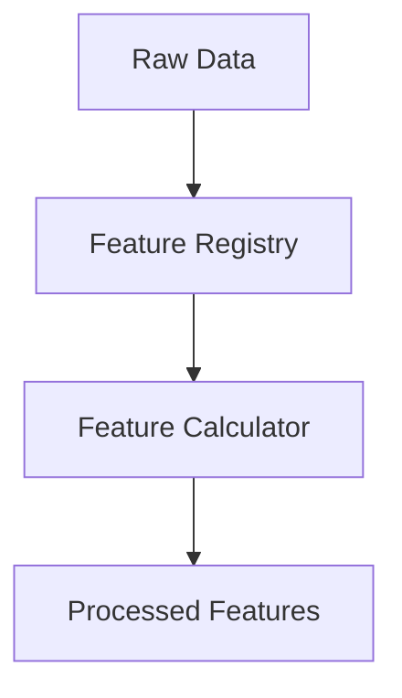

# Documentation Strategy

This project uses MkDocs with the Material theme for comprehensive documentation. The documentation strategy is designed to serve multiple audiences, from developers to users, with clear organization and automatic generation where possible.

## Documentation Structure

The documentation is organized into the following main sections:

1. **Project Overview** - General introduction to the project
2. **Architecture** - Architectural decisions and system design
3. **Development Guides** - Information for developers contributing to the project
4. **User Guides** - Information for users of the prediction model
5. **API Reference** - Automatically generated API documentation
6. **Tutorials** - Step-by-step guides for common tasks

## Documentation Sources

Documentation comes from multiple sources:

1. **Markdown Files** - Handwritten documentation in `docs/`
2. **Docstrings** - API documentation extracted from code docstrings
3. **ADRs** - Architecture Decision Records in `docs/architecture/`
4. **Examples** - Example code from `examples/` and `notebooks/`

## Auto-generation

Automated documentation generation is used where possible:

1. **API Reference** - Generated with `mkdocstrings` from docstrings
2. **Navigation** - Generated with `literate-nav`
3. **Examples** - Generated from example notebooks

### API Documentation Generation

The `gen_ref_pages.py` script generates API reference documentation by examining the source code structure:

```python
"""Generate the code reference pages and navigation."""

import os
from pathlib import Path

import mkdocs_gen_files

nav = mkdocs_gen_files.Nav()

for path in sorted(Path("src").rglob("*.py")):
    module_path = path.relative_to("src").with_suffix("")
    doc_path = path.relative_to("src").with_suffix(".md")
    full_doc_path = Path("reference", doc_path)

    parts = tuple(module_path.parts)
    
    if parts[-1] == "__init__":
        parts = parts[:-1]
        doc_path = doc_path.with_name("index.md")
        full_doc_path = full_doc_path.with_name("index.md")
    elif parts[-1] == "__main__":
        continue

    nav[parts] = doc_path.as_posix()

    with mkdocs_gen_files.open(full_doc_path, "w") as fd:
        ident = ".".join(parts)
        fd.write(f"# `{ident}`\n\n")
        fd.write(f"::: {ident}")

    mkdocs_gen_files.set_edit_path(full_doc_path, path)

with mkdocs_gen_files.open("reference/SUMMARY.md", "w") as nav_file:
    nav_file.write(nav.build_literate_nav())
```

## Documentation Style Guide

### Docstrings

All modules, classes, methods, and functions should use [Google-style docstrings](https://google.github.io/styleguide/pyguide.html#38-comments-and-docstrings):

```python
def calculate_feature(data: pl.DataFrame, window_size: int = 5) -> pl.DataFrame:
    """Calculate a feature using a rolling window approach.
    
    This function computes a statistical feature over a specified window
    of games for each team.
    
    Args:
        data: DataFrame containing game data
        window_size: Number of games to include in the rolling window
        
    Returns:
        DataFrame with the calculated feature
        
    Raises:
        ValueError: If window_size is less than 1
    
    Example:
        ```python
        result = calculate_feature(game_data, window_size=10)
        ```
    """
```

### Markdown Files

Markdown files should follow these guidelines:

1. Start with a level-1 heading as the title
2. Use hierarchical heading levels without skipping (e.g., h1 -> h2 -> h3)
3. Include code examples where helpful
4. Use admonitions for important notes/warnings
5. Include diagrams for complex concepts (using Mermaid.js)

Example:

```markdown
# Feature Engineering Pipeline

## Overview

The feature engineering pipeline processes raw game data into model-ready features.

!!! note
    All features are calculated using the Polars library as defined in ADR-003.

## Pipeline Components

### Feature Registry

The Feature Registry maintains a catalog of available features...


```

## Version Control for Documentation

Documentation should be version-controlled along with code:

1. Document changes should be included in the same PR as code changes
2. Major documentation updates should be reviewed separately
3. Breaking changes should include updates to relevant documentation

## Documentation Testing

Documentation is tested as part of the CI/CD pipeline:

1. Links are checked for validity
2. Code examples are tested where possible
3. Build errors are caught before deployment

## Documentation Deployment

Documentation is automatically deployed:

1. Built on each merge to main
2. Deployed to GitHub Pages or a similar hosting service
3. Versioned to align with software releases 