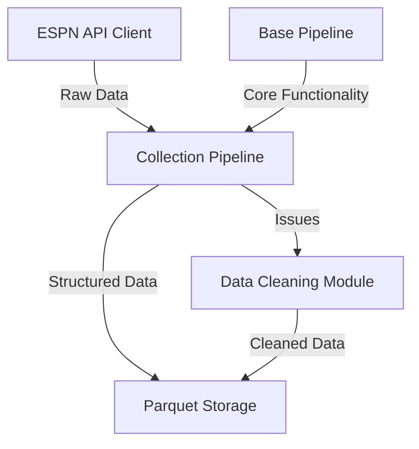
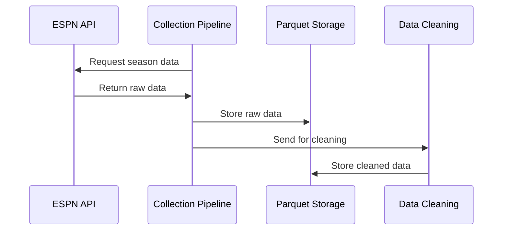

# Milestone Example: Data Collection Pipeline

> **Note:** This document serves as the standard format for all milestone documents in this project. Use this example as a template when creating new milestones, adapting each section to the specific milestone requirements while maintaining the overall structure.

This milestone focuses on building the foundation for NCAA basketball predictions by establishing a reliable data collection system from ESPN APIs. It creates standardized data retrieval, transformation, and storage processes for historical and ongoing basketball game data.

## Objectives
- Build a reliable integration with ESPN API for retrieving historical NCAA basketball data
- Implement the Base Pipeline and Collection Pipeline components
- Create efficient data loading and transformation pipelines
- Implement data cleaning and validation routines to ensure data quality
- Establish automated processes for incremental data updates
- Store all collected data in Parquet file format

## Deliverables
| Deliverable | Description |
|-------------|-------------|
| ESPN API Client | Python module to interact with ESPN API endpoints with rate limiting and error handling |
| Base Pipeline | Core pipeline class with shared functionality for all pipeline components |
| Collection Pipeline | Pipeline for extracting data from ESPN API and storing as Parquet files |
| Data Cleaning Module | Routines for identifying and cleaning inconsistent or problematic data |
| Initial Dataset | Complete dataset of NCAA basketball games from 2002-present stored as Parquet files |
| Documentation | Technical documentation of API integration, data schema, and data dictionary |

## Acceptance Criteria
The milestone will be considered complete when:

- [ ] API client can successfully retrieve data from all required ESPN endpoints
- [ ] Base Pipeline framework is implemented and documented
- [ ] Collection Pipeline can fully process and store data from API to Parquet files
- [ ] Historical data for all seasons (2002-present) is successfully collected
- [ ] Data cleaning routines identify and handle common data issues
- [ ] Pipeline handles API rate limits and errors gracefully
- [ ] Data retrieval and storage processes are fully documented
- [ ] All tests for data collection components are passing

## Technical Details
### Architecture
The data collection system will follow the pipeline architecture with clear separation of concerns:

### Components
- **Base Pipeline**: Provides core functionality for all pipeline components
- **API Client Module**: Responsible for communication with ESPN API
- **Collection Pipeline**: Orchestrates the data collection and storage
- **Data Models**: Represent the structure of data from API
- **Parquet Storage Utilities**: Handle reading and writing Parquet files

### Data Flow

## Resources
### Required Tools and Technologies
- Python 3.11+: Primary development language
- Polars: Data manipulation library (NOT pandas)
- Pyarrow: Parquet file operations
- Requests: HTTP client for API interactions
- Pydantic: Data validation and modeling
- Pytest: Testing framework

## Dependencies
### Prerequisite Milestones
- None (this is the first milestone)

### External Dependencies
- ESPN API availability and consistency
- Sufficient historical data availability through API

## Risks and Mitigations
| Risk | Impact | Likelihood | Mitigation Strategy |
|------|--------|------------|---------------------|
| ESPN API changes or limits | High | Medium | Implement version checking, rate limiting, and fallback mechanisms |
| Incomplete historical data | High | Medium | Identify alternative data sources for supplementation |
| Data format inconsistencies | Medium | High | Build robust data validation and transformation logic |
| Large Parquet files degrading performance | Medium | Low | Implement partitioning and optimization strategies |