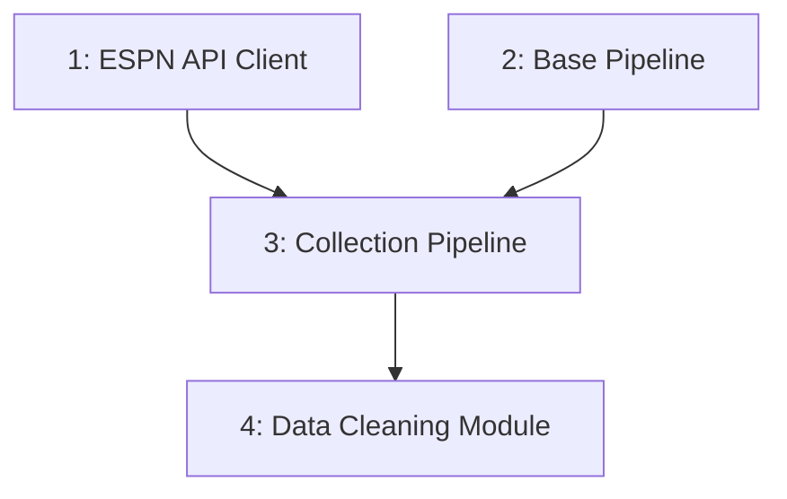

# Milestone 1 Tasks

This document lists all tasks for Milestone 1: Data Collection and Storage.

## Task List

| Task ID | Task Name | Priority | Status | Assigned To | GitHub Issue |
|---------|-----------|----------|--------|------------|--------------|
| 1 | [Implement ESPN API Client](./api_integration.md) | High | Not Started | TBD | [#3](https://github.com/tim-mcdonnell/ncaa-prediction-model/issues/3) |
| 2 | [Implement Base Pipeline Component](./base_pipeline.md) | High | Not Started | TBD | [#4](https://github.com/tim-mcdonnell/ncaa-prediction-model/issues/4) |
| 3 | [Implement Collection Pipeline](./collection_pipeline.md) | High | Not Started | TBD | [#5](https://github.com/tim-mcdonnell/ncaa-prediction-model/issues/5) |
| 4 | [Implement Data Cleaning Module](./data_cleaning.md) | Medium | Not Started | TBD | [#6](https://github.com/tim-mcdonnell/ncaa-prediction-model/issues/6) |

## Task Dependencies

## Implementation Order

The recommended implementation order is:

1. Task #1: ESPN API Client and Task #2: Base Pipeline (can be worked on in parallel)
2. Task #3: Collection Pipeline (depends on #1 and #2)
3. Task #4: Data Cleaning Module (depends on #3)

## Task Status Updates

### [2023-03-11]
- Initial task list created
- All tasks are in "Not Started" status
- GitHub issues created and linked to tasks

## Next Steps

After all Milestone 1 tasks are completed, we will:

1. Have a complete data collection system for NCAA basketball data
2. Begin work on the Processing Pipeline (Milestone 2)
3. Document the collected data structure for feature engineering 