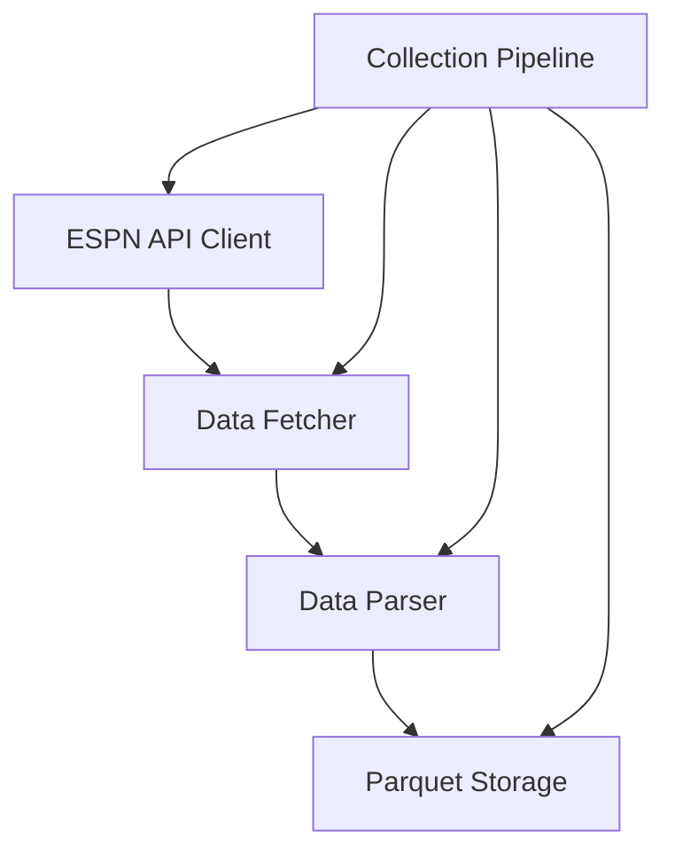

# Milestone Example: Data Collection Pipeline

## Overview

This milestone focuses on implementing the data collection pipeline for retrieving NCAA basketball data from ESPN APIs. This component is foundational for the entire prediction model, providing the raw data needed for feature engineering and predictions.

## Objectives

- Build a reliable, resilient system for collecting data from ESPN APIs
- Implement incremental update capability to efficiently retrieve only new/changed data
- Develop parsers to standardize raw API responses into consistent formats
- Store collected data in organized Parquet files for further processing

## Architecture

The collection pipeline consists of these key components:

## Key Components

### 1. ESPN API Client

A low-level client responsible for making HTTP requests to ESPN endpoints, managing rate limiting, and handling connection issues.

**Key files:**
- `src/data/collection/espn/client.py`
- `tests/data/collection/espn/test_client.py`

### 2. Data Parsers

Transformers that convert raw ESPN API responses into standardized formats suitable for storage.

**Key files:**
- `src/data/collection/espn/parsers.py`
- `tests/data/collection/espn/test_parsers.py`

### 3. Parquet Storage

Utilities for saving parsed data to Parquet files with appropriate directory structure and schema.

**Key files:**
- `src/data/storage/parquet_io.py`
- `tests/data/storage/test_parquet_io.py`

### 4. Collection Pipeline

Orchestrates the entire collection process, managing incremental updates and coordinating between components.

**Key files:**
- `src/pipelines/collection_pipeline.py`
- `tests/pipelines/test_collection_pipeline.py`

## Tasks Breakdown

This milestone can be broken down into the following tasks, ideal for implementation by AI coding agents:

1. **Implement ESPN API Client**
   - Create HTTP client with appropriate rate limiting
   - Implement connection resilience (retries, circuit breakers)
   - Support multiple ESPN endpoints (games, teams, rankings)

2. **Develop Game Data Parser**
   - Transform raw game data responses into standardized format
   - Handle different game statuses and response structures
   - Extract team, venue, and score information

3. **Implement Team Data Parser**
   - Transform team roster and information into standardized format
   - Handle team rankings and statistics
   - Normalize team identifiers across seasons

4. **Create Parquet Storage Utilities**
   - Implement save/load functions for Parquet data
   - Create appropriate directory structure and partitioning
   - Add schema validation for data consistency

5. **Build Collection Pipeline Orchestrator**
   - Implement pipeline coordinator class
   - Add incremental update logic to avoid redundant fetching
   - Create CLI interface for running collection tasks

## Implementation Approach

Each task should follow these principles:

1. **Test-First Development**: Create comprehensive tests before implementation
2. **Incremental Complexity**: Start with simple implementations and enhance iteratively
3. **Clear Interfaces**: Define explicit input/output contracts between components
4. **Error Handling**: Implement robust error handling with appropriate fallback strategies
5. **Documentation**: Document component behavior and important design decisions

## Dependencies

- Python 3.11+
- Polars for data manipulation
- aiohttp for asynchronous HTTP requests
- Pydantic for validation

## Success Criteria

This milestone will be considered complete when:

1. All tests for collection components pass
2. The collection pipeline can:
   - Fetch complete historical seasons (2002-present)
   - Perform incremental updates during a season
   - Handle API errors gracefully
   - Store data in appropriate Parquet format

3. Documentation is complete and up-to-date
4. Code follows project structure and conventions

## Risks and Mitigations

| Risk | Mitigation |
|------|------------|
| ESPN API changes formats | Build flexible parsers with robust error handling |
| Rate limiting/blocking | Implement appropriate backoff strategies and rate limiting |
| Missing historical data | Document known gaps and handle gracefully in data processing |
| Large data volumes | Use efficient Parquet compression and partitioning |

## Timeline

Estimated implementation time: 2-3 weeks

- Week 1: ESPN client and parsers
- Week 2: Storage utilities and initial pipeline
- Week 3: Full pipeline integration and testing 