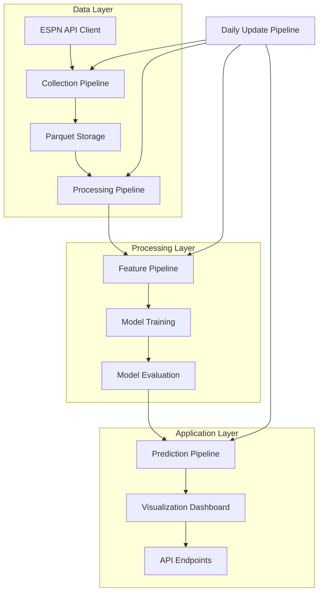

# System Architecture

## High-Level Architecture

The NCAA Basketball Prediction Model is built with a modular pipeline architecture that separates concerns and allows for independent development and testing of components.

## Component Breakdown

### Data Layer

- **ESPN API Client**: Handles communication with the ESPN API, including rate limiting and error handling.
- **Collection Pipeline**: Orchestrates data retrieval and synchronization, with support for incremental updates.
- **Parquet Storage**: Stores data in columnar Parquet files organized by processing stage.
- **Processing Pipeline**: Cleans and transforms raw data into standardized formats.

### Processing Layer

- **Feature Pipeline**: Calculates 60+ basketball metrics with automatic dependency resolution.
- **Model Training**: Builds and optimizes prediction models.
- **Model Evaluation**: Assesses model performance with appropriate metrics.

### Application Layer

- **Prediction Pipeline**: Generates predictions for upcoming games.
- **Visualization Dashboard**: Provides interactive visualizations of data and predictions.
- **API Endpoints**: Offers programmatic access to predictions and data.

### Cross-Cutting Concerns

- **Daily Update Pipeline**: Combines all pipelines for efficient daily updates during basketball season.
- **Configuration Management**: Provides centralized configuration for all components.
- **Logging and Monitoring**: Tracks pipeline execution and performance.

## Technical Decisions

### Storage Strategy

We use a Parquet-first approach for data storage, which provides:

- **Columnar Format**: Optimized for analytical queries and feature calculation
- **Efficient Compression**: Reduced storage requirements
- **Schema Evolution**: Flexibility as data formats evolve
- **Partitioning**: Organization by season, team, or other dimensions
- **Direct Integration**: Seamless use with Polars for data processing

### Pipeline Architecture

Our pipeline architecture is designed for:

- **Incremental Processing**: Only update what has changed
- **Dependency Management**: Calculate features in the correct order
- **Configuration Management**: Flexible control of pipeline behavior
- **Error Handling**: Robust recovery from failures
- **Progress Tracking**: Visibility into long-running processes
- **Simple CLI**: Easy execution of pipeline components

### Data Processing

We use Polars for all data processing, which provides:

- **Performance**: 10-100x faster than traditional pandas for our workloads
- **Memory Efficiency**: Better handling of large datasets
- **Expressive API**: Clean, functional data transformation
- **Lazy Evaluation**: Optimized execution plans
- **Parallelism**: Automatic use of multiple cores

## Future Considerations

- **Feature Evolution**: The architecture supports adding new basketball metrics over time
- **Model Experimentation**: Pipeline design enables testing different modeling approaches
- **Visualization Extensions**: The dashboard can be expanded with new views and insights
- **Real-time Updates**: The system could be extended for real-time predictions during games
- **Cloud Deployment**: The architecture supports containerization for cloud deployment 