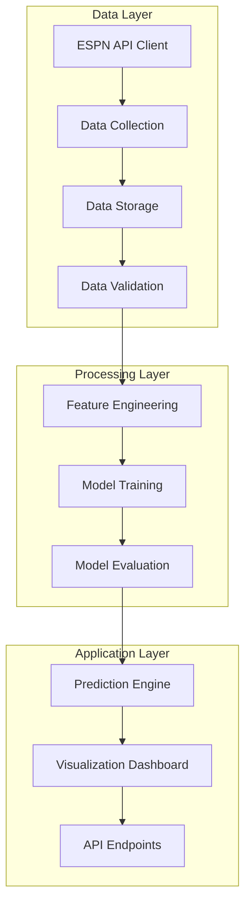

# System Architecture

## High-Level Architecture

The NCAA Basketball Prediction Model is built with a modular architecture that separates concerns and allows for independent development and testing of components.

## Component Breakdown

### Data Layer

- **ESPN API Client**: Handles communication with the ESPN API, including rate limiting and error handling.
- **Data Collection**: Orchestrates data retrieval and synchronization.
- **Data Storage**: Manages the database schema and storage operations.
- **Data Validation**: Ensures data quality and handles missing or inconsistent data.

### Processing Layer

- **Feature Engineering**: Transforms raw data into features suitable for modeling.
- **Model Training**: Builds and optimizes prediction models.
- **Model Evaluation**: Assesses model performance with appropriate metrics.

### Application Layer

- **Prediction Engine**: Generates predictions for upcoming games.
- **Visualization Dashboard**: Provides interactive visualizations of data and predictions.
- **API Endpoints**: Offers programmatic access to predictions and data.

## Technical Decisions

### Storage Strategy

We're starting with SQLite for simplicity during development but with a database abstraction layer that will allow us to migrate to PostgreSQL if needed for scaling. The schema is normalized to optimize for:

- Data integrity
- Query performance for feature extraction
- Support for time-series analysis

### Model Pipeline

The model pipeline is designed with scikit-learn's pipeline API to ensure:

- Consistent preprocessing steps
- Reproducible model training
- Proper cross-validation
- Model persistence

### Visualization Approach

The dashboard is built with Dash and Plotly to provide:

- Interactive visualizations
- Real-time filtering and exploration
- Shareable insights
- Responsive design

## Future Considerations

- **Scalability**: The current architecture can handle the historical data load, but may need optimization if expanded to include more granular data.
- **Real-time Processing**: The system is currently batch-oriented but could be extended for real-time predictions.
- **Deployment**: The architecture supports containerization for cloud deployment. 