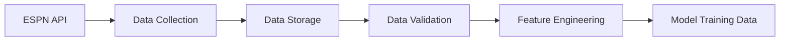

# Project Overview

## Purpose and Goals

The NCAA Basketball Prediction Model aims to create a sophisticated machine learning system that can accurately predict outcomes of NCAA men's basketball games. By analyzing historical data from the past 22 years, the model will provide predictions for:

- Game winners and win probabilities
- Point spreads (similar to betting lines)
- Total points (over/under)
- Team performance metrics and ratings

This project has both academic and practical applications, from understanding the key factors that influence basketball outcomes to potentially informing basketball analysts and enthusiasts.

## Key Components

### Data Pipeline

The data pipeline is responsible for retrieving, cleaning, and preparing the data for analysis:

### Modeling Approach

The modeling system will employ a multi-stage approach:

1. **Team Rating System**: Develop underlying metrics for team strength
2. **Matchup Analysis**: Analyze historical matchups and performance patterns
3. **Prediction Models**: Apply machine learning techniques to predict outcomes
4. **Evaluation Framework**: Assess model performance against historical results

### Visualization and Reporting

The project includes a dashboard for exploring:

- Team performance metrics and trends
- Game prediction results
- Model performance and accuracy
- Feature importance and analysis

## Project Scope

### In Scope

- Historical NCAA men's basketball game data (2000-2023)
- Regular season and tournament games
- Team performance metrics and statistics
- Prediction models for game outcomes
- Visualization dashboard for results

### Out of Scope

- Real-time game predictions during gameplay
- Player-level detailed analysis
- Image or video analysis of games
- Betting optimization strategies
- Women's basketball data (potential future extension)

## Success Criteria

The project will be considered successful if:

1. The model achieves better accuracy than baseline approaches (e.g., simple ranking systems)
2. Predictions are within a competitive margin compared to Vegas betting lines
3. The system provides interpretable insights into key factors driving game outcomes
4. The dashboard effectively visualizes predictions and underlying data
5. The codebase is well-documented, tested, and maintainable 